# FreeSpace — System Architecture

Technical design documentation for the FreeSpace peer-to-peer parking marketplace
(freespace.ie). Every diagram documents the **actual deployed system** as of July 2026 —
sources were verified against `apps/api/src`, `apps/mobile`, `apps/web`, and
`deploy/lightsail` rather than an aspirational design. Where a commonly expected capability
does not exist (direct driver–host messaging, a payout cron), the diagram says so instead of
inventing it.

All diagrams are Mermaid and render natively on GitHub. Flowcharts share one colour code:

- **Blue** — client applications (Expo mobile, Next.js web)
- **Slate** — edge and infrastructure (Caddy, Lightsail, CI/CD)
- **Green** — the API application domain (Express, single process)
- **Amber** — data at rest (RDS Postgres + PostGIS, S3)
- **Violet** — external services (Stripe, Google, Expo Push, SMTP, SNS, Anthropic, PostHog)
- **Pink** — asynchronous work (webhooks, background loops)

## 0. At a glance

The whole system in one picture: two sides of a marketplace, one API, one database, and
Stripe closing the money loop. Everything else in this document is detail inside these boxes.

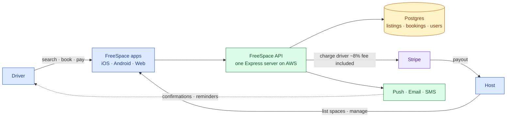

**Reading notes**

- A driver books and pays in the app; the API records it in Postgres and charges through
  Stripe; the host gets paid out by Stripe; both sides get notified. That is the entire
  business in one loop.

## 1. Overall system architecture

One Express process serves both clients through Caddy. There is no ORM: every SQL statement
lives in `lib/db.ts`. Stripe is the only money authority — the API creates PaymentIntents and
transfers, and Stripe webhooks (raw-body routes, exempt from the JSON parser) are the source
of truth for booking confirmation and Connect account state. Background work runs as
`setInterval` loops inside the same process, which is why rate limits and fraud caches are
documented as in-memory: **the architecture assumes exactly one API instance.**

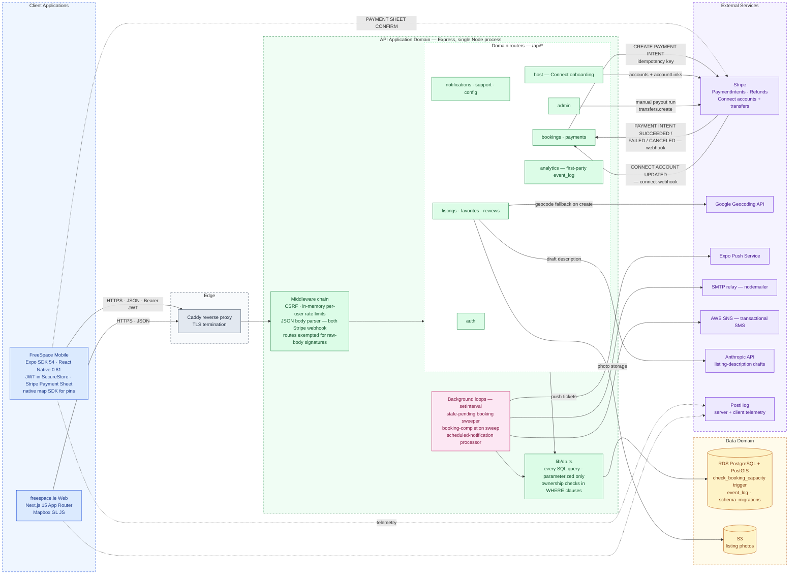

**Reading notes**

- The two dashed client edges to Stripe and PostHog are direct client↔service calls that
  bypass the API: the Stripe Payment Sheet confirms payment on-device, and telemetry ships
  straight to PostHog.
- The `analytics` router is first-party: it writes client events to `event_log` in Postgres,
  separate from PostHog.
- Both webhook arrows terminate at the bookings router deliberately — webhook handling and
  the payout trigger live in `routes/bookings.ts`, not in a separate worker.

## 2. Infrastructure & deployment architecture

Production is deliberately small: one Lightsail box running three containers via
`deploy/lightsail/compose.prod.yml`, plus managed RDS. The former ECS/ALB stack was torn down
in June 2026 — the `rollback-api.yml` workflow still targets it and must not be used; rollback
is manual per `docs/ops/rollback-playbook.md`.

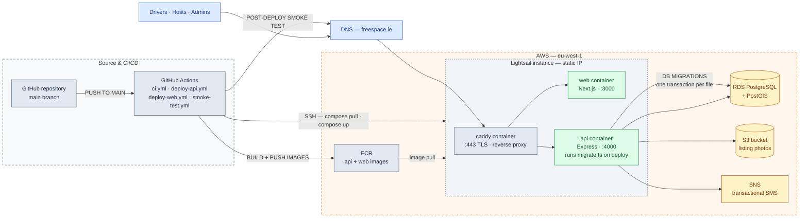

**Reading notes**

- Deploy pipeline: push to `main` → Actions build → ECR → SSH to the box → `compose up` →
  `migrate.ts` (append-only numbered SQL, one transaction per file, tracked in
  `schema_migrations`) → smoke test against the live domain.
- The single-instance constraint is architectural, not incidental: rate limits and fraud
  caches live in process memory. Scaling to a second API container requires a Redis-backed
  redesign first.
- Environment is validated by Zod at boot (`src/env.ts`); the api container refuses to start
  on bad config rather than degrading.

## 3. Authentication flow

Auth is stateless JWT (HS256, 7-day expiry) minted by `/api/auth` and verified by
`requireAuth` middleware. Money-touching capabilities are gated harder than plain login:
booking, hosting, and payments all additionally require a verified email and a non-suspended
account.

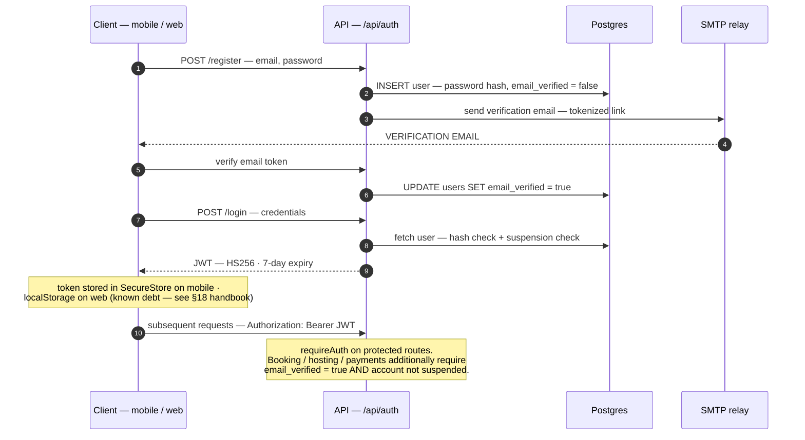

**Reading notes**

- There is no refresh-token rotation; the 7-day JWT is the whole session. Expiry forces
  re-login.
- Suspension is checked at login **and** enforced per-request on gated routes, so suspending
  a user takes effect before their token expires.

## 4. Search & discovery flow

Search is explicit and honest: no auto-search on map move, no artificial loaders. The server
owns geography (PostGIS radius queries) and display price (parking cost × 1.08, computed
server-side and shown as a single number to the driver).

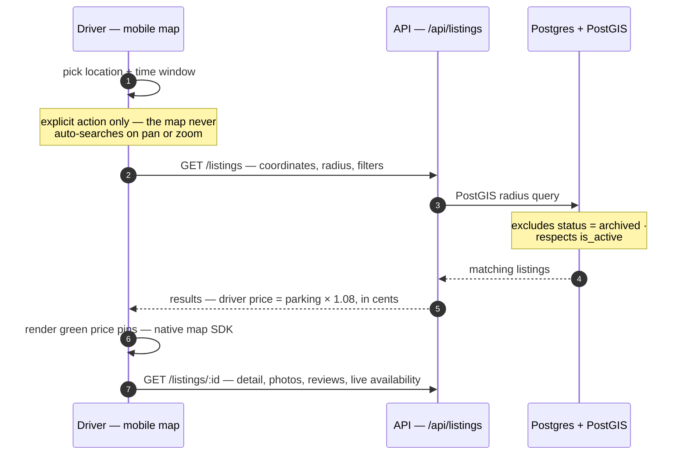

**Reading notes**

- Listing photos are served from S3; addresses were geocoded at creation time (Google
  Geocoding fallback when the client sends zeroed coordinates), so search itself never calls
  an external geo service.
- Availability shown here is a convenience read. The real capacity guarantee is the DB
  trigger in the booking flow (§5).

## 5. Booking flow

The core marketplace transaction. Three invariants shape it: the server owns all money math
and rejects mismatched client totals; the `check_booking_capacity` trigger — not route code —
is what prevents overbooking; and the Stripe webhook, not the client, is the source of truth
for confirmation.

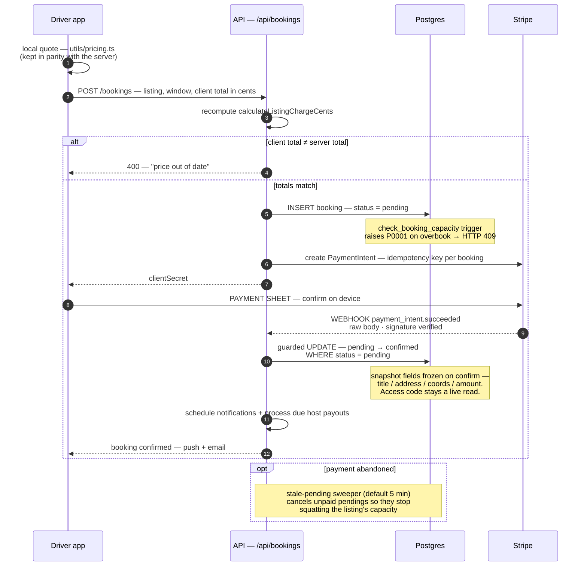

**Reading notes**

- The client-side confirm path also exists but is only an optimization; both paths are
  idempotent, so a replayed webhook or a race between the two cannot double-confirm.
- A separate completion sweep advances confirmed bookings past their end time to
  `completed`, which is what makes them payout-eligible (§8).
- Confirmed bookings are contracts: listing edits and archival must never mutate the frozen
  snapshot (shipped as migration 042).

## 6. Payment flow

Money is integer cents everywhere (`_cents` suffix), and the platform fee is baked into the
displayed price rather than added at checkout: the driver pays parking × 1.08 and the fee is
gross × 8⁄108.

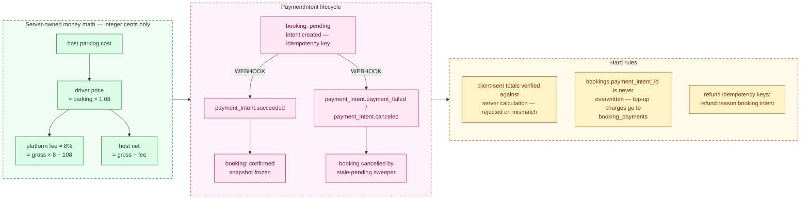

**Reading notes**

- `apps/mobile/utils/pricing.ts` must stay behaviourally identical to the API's
  `calculateListingChargeCents`; they change together with both test suites or every booking
  400s with "price out of date".
- Every Stripe create call carries an idempotency key, so webhook replays and network
  retries are safe by construction.

## 7. Cancellation & refund flow

Refunds are tiered by `lib/cancellationPolicy.ts` — a 15-minute post-booking grace window
and a 4-hour free cutoff before the start time, with reduced refunds inside the final hours
when the space is committed.

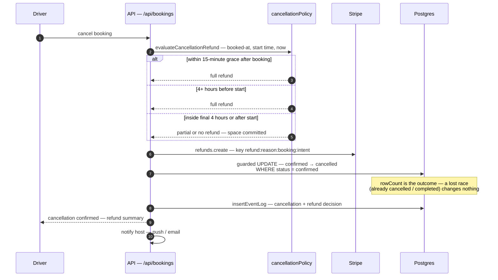

**Reading notes**

- The deterministic refund key means retrying a failed cancellation can never double-refund.
- Host-side and admin-side cancellations follow the same guarded-update pattern with their
  own refund reasons, which produce distinct idempotency keys.

## 8. Host payout flow

Payouts use Stripe Connect Express accounts and destination transfers of the host's net
(gross − platform fee). There is **no payout cron**: transfers run opportunistically inside
the payment webhook whenever any of the host's bookings gets paid, plus a manual admin
trigger (`POST /api/admin/payouts/run`). A host with no new bookings can therefore wait
indefinitely — a known launch-hardening gap.

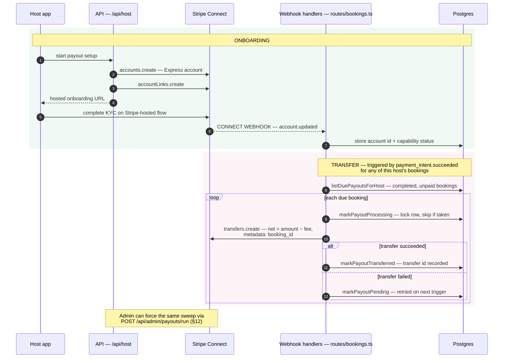

**Reading notes**

- The `markPayoutProcessing` lock is what makes concurrent webhook deliveries safe: only one
  handler can move a booking from pending to processing.
- Transfers are skipped entirely unless `STRIPE_CONNECT_ENABLED=true` and the host has a
  real (non-mock) Connect account — the local/dev lanes run with mock accounts.

## 9. Messaging & support flow

**Direct driver↔host messaging is not implemented.** There is no messages table, router, or
realtime channel in the codebase; contact between parties happens through booking metadata
(access code, arrival instructions) and notifications. What exists today is a support-ticket
pipeline into the admin surface — the diagram documents that real flow, with in-thread
messaging left as a roadmap item rather than drawn as if it existed.

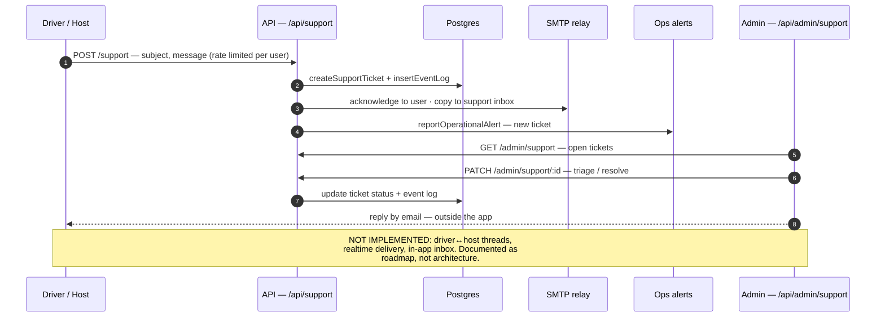

**Reading notes**

- If in-app messaging is built later, the single-process constraint matters: realtime
  delivery (websockets/SSE) would be the first feature to break the "one API container"
  assumption after horizontal scaling.

## 10. Notification delivery

Notifications are queued in Postgres and drained by a processor that can be invoked two
ways: an in-process interval loop, and a secret-protected `POST /notifications/process`
endpoint for external triggering. Delivery fans out to three channels.

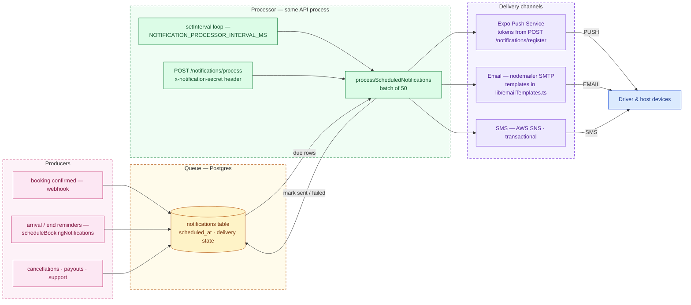

**Reading notes**

- Device push tokens are registered per-user via `POST /notifications/register` (and removed
  via `DELETE`), both behind auth, a blocked-list check, and a rate limiter.
- Queuing through Postgres rather than firing inline means a channel outage delays delivery
  instead of losing it — rows stay due until marked sent.

## 11. Review submission flow

Reviews are driver-authored, tied to real bookings, and publicly readable per listing.

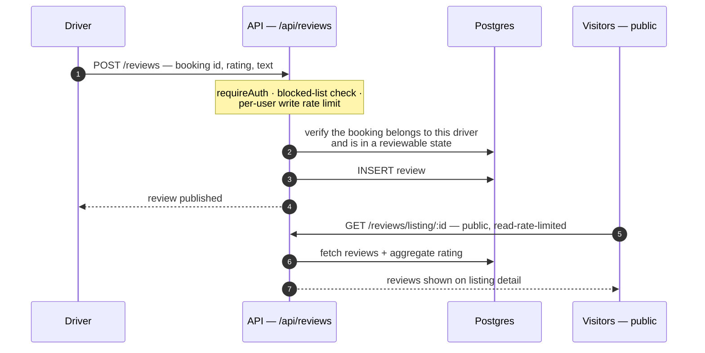

**Reading notes**

- Eligibility is enforced in SQL (ownership in the `WHERE` clause), consistent with the
  repo-wide rule that ownership checks never happen post-fetch.
- No fabricated social proof anywhere: listing ratings are pure aggregates of real rows.

## 12. Admin moderation & operations

Admin is an API surface (`/api/admin`, `requireAdmin`, separate read/write rate limiters)
consumed from the mobile app's admin screen. Every write lands in `event_log`, which is the
operator's reconstruction tool.

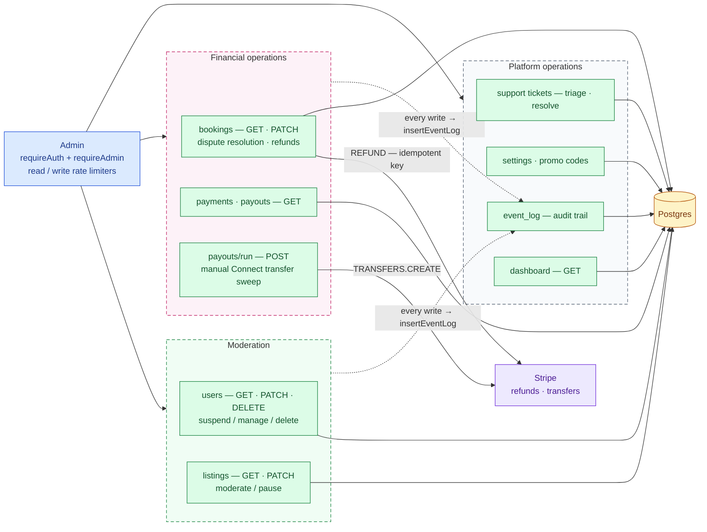

**Reading notes**

- Known debt, deliberately drawn as-is: moderated/paused listings are still searchable, and
  account deletion currently hard-deletes financial records. Both are tracked launch items,
  not design intent.
- "Delete" for listings means `status = 'archived'` — moderation never destroys rows.

---

*Generated 2026-07-10 from the live codebase. Companion rendered version: see the
"FreeSpace System Architecture" artifact. When the system changes, update the Mermaid source
here — GitHub renders it directly.*
