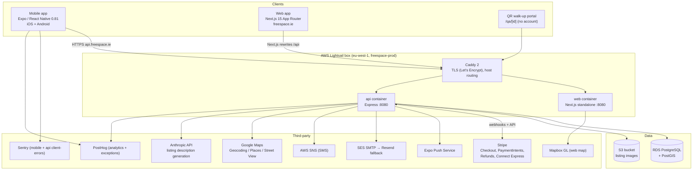
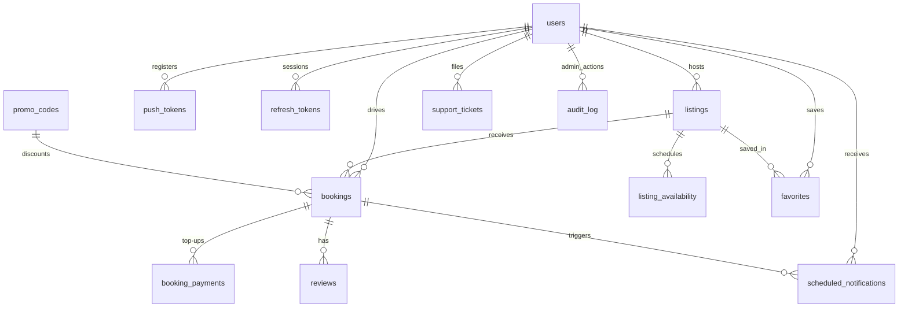
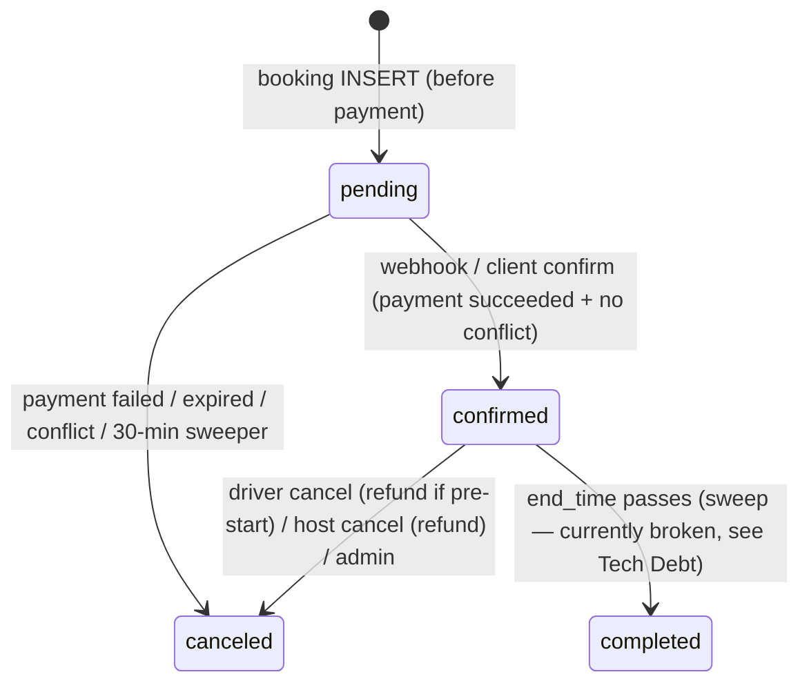

# FreeSpace — Engineering Handbook

> Complete knowledge-transfer document for the FreeSpace peer-to-peer parking marketplace.
> Written from a full read of the repository as of 2026-07-06 (branch `mobile-profile-redesign`, last commit `4f6a9a9`).
> Audience: a senior engineer or AI agent taking over maintenance, extension, and deployment.

---

# 1. Executive Summary

**What it does.** FreeSpace (repo name `carpark`, brand domain `freespace.ie`) is a peer-to-peer parking marketplace for Ireland (Dublin-centric). Hosts list private parking spaces (driveways, gated spots, garages); drivers search by location/time on a map, book, and pay through Stripe. The platform takes an ~8% cut baked into the displayed price.

**Target users.**
- **Drivers** — need short-term (hourly/daily) parking near stadiums, hospitals, transit, city centre. Primary surface: the Expo/React Native mobile app.
- **Hosts** — homeowners/businesses with spare spaces. Create listings via a multi-step wizard (mobile and web), manage availability, receive payouts via Stripe Connect Express.
- **Walk-up guests** — can scan a listing's QR code and pay without an account (`/qa/[id]` portal).
- **Operators/admins** — role-gated admin panel (web `/admin` + mobile AdminScreen) for users, listings, bookings, payments, payouts, support, fraud settings, promos.

**Core value proposition.** Cheaper, closer parking than commercial car parks; passive income for space owners; instant booking with server-verified pricing, refunds, reminders, and access instructions.

**Current development status.** Pre-public-launch / private-beta hardening. The product is functionally complete (search → book → pay → extend/cancel → review → payout) with real Stripe, real infrastructure, CI, and smoke monitoring. Launch blockers tracked in `docs/release/public-launch-checklist.md` and the 2026-07 launch audit: production mobile builds still ship a **test** Stripe publishable key, iOS has never been submitted, and live payment/payout flows are not fully proven end-to-end. Monthly parking is marketed/searchable but not bookable (enquiry CTA interim; recurring Stripe subscriptions are the target).

**Major technical decisions.**

| Decision | Rationale / consequence |
|---|---|
| Yarn-workspaces monorepo (`apps/web`, `apps/api`, `apps/mobile`) | One API contract, shared conventions; single CI pipeline |
| Express + raw `pg` + hand-written SQL (no ORM) | Full control over PostGIS + `tstzrange` queries; `lib/db.ts` is a 4.4k-line data layer |
| PostgreSQL + PostGIS on RDS | Geospatial search (`ST_DWithin`), GiST indexes, range-overlap booking logic in the database |
| Capacity enforcement via DB trigger (`check_booking_capacity`) | Concurrency-safe overbooking prevention independent of app code (migrations 036/044) |
| Two Stripe payment paths | Hosted Checkout (web + QR portal), PaymentIntent + Payment Sheet (mobile) |
| Booking snapshot (migration 042) | Confirmed bookings freeze address/coords/title; listing edits can't relocate a booked space |
| Server-owned pricing and fees | Client-sent amounts are only *verified*, never trusted; platform fee is a server constant |
| Single Lightsail box + Caddy for prod (migrated off ECS/ALB 2026-06-15) | ~$27/mo vs ECS cost; same ECR images; RDS retained off-box |
| Expo (managed + config plugins) with EAS builds | Per-env lanes (`local`/`dev`/`qa`/`production`), dev/prod bundle IDs, OTA-free release discipline |
| Server-switchable Stripe publishable key (`GET /api/config`) | Flip test→live mode for all installed apps without a store release |
| Zod validation at every boundary (API env, request bodies, mobile env) | Misconfiguration fails at boot, not at first request |

---

# 2. High-Level Architecture



### 2.1 Mobile app (`apps/mobile`)
- Expo SDK 54 / React Native 0.81 / React 19, TypeScript. Entry `index.js` → `App.tsx`.
- Navigation: React Navigation — one native stack (`RootStackParamList` in `types.ts`) wrapping a 4-tab bottom navigator (Discover/Search, Bookings/History, Saved/Favorites, Profile). `enableFreeze(true)` + `freezeOnBlur` stop off-screen trees (map under listing page) from re-rendering.
- Providers (outermost→in): `ErrorBoundary` → `SafeAreaProvider` → `StripeProvider` (publishable key resolved from `GET /api/config` with baked-in fallback, `remoteConfig.ts`) → `AuthProvider` → `FavoritesProvider` → `GlobalLoading` → `GlobalToast`.
- Deep links (`carparking://` prod, `carparking-dev://` dev): `verify-email`, `reset-password`, `bookings/<id>`, `e2e` (Maestro test-mode scenarios). Notification taps deep-link to booking detail / review form, with an "Extend +" action category (`booking_ending`).
- Design system: `theme/` (colors/spacing/typography/shadows), `designTokens.ts`, Plus Jakarta Sans fonts, shared `components/ui/*` kit, `components/profileUi.tsx` (Too Good To Go-style profile), `MOBILE_UI_GUIDELINES.md`.
- Per-env config lanes via `app.config.js` (`APP_ENV` → `.env.<env>`): separate Android package (`ie.freespace.app` vs `.dev`), iOS bundle (`com.andrewsyl.carparking` vs `.dev`), and URL scheme. `env.ts` hard-fails builds on invalid combinations (live key outside prod, localhost API in prod, etc.).

### 2.2 Backend (`apps/api`)
- Express (ESM, TS → `dist`), created by `createApp()` in `src/app.ts`; process wiring in `src/index.ts`.
- Middleware pipeline: request-id → structured request logging → security headers (HSTS, nosniff, frame-deny, referrer, permissions-policy) → HTTPS redirect (`ENFORCE_HTTPS`) → CORS allowlist (WEB_BASE_URL ± `www.`, localhost dev ports; dev allows all) → CSRF origin/token check → JSON body parser (**skipped** for the two Stripe webhook routes, which need the raw body).
- Routers: `/api/auth`, `/api/analytics`, `/api/listings`, `/api/favorites`, `/api/bookings`, `/api/host`, `/api/reviews`, `/api/admin`, `/api` (payments), `/api/support`, `/api/notifications`, `/api/config`.
- Background loops in `index.ts` (per-process `setInterval`): scheduled-notification processor (prod: 60s), stale-pending-booking sweeper (5 min, cancels abandoned payment-sheet bookings >30 min old), confirmed→completed sweep (5 min — **currently broken, see §18**).
- Central error handler: Zod → 422 with field errors; Stripe-shaped errors → 400 with code/param; everything else → 500 with `requestId`. All errors logged + sent to PostHog `captureException`.

### 2.3 Authentication
JWT access tokens (7d, HS256) + rotating refresh tokens (30d, per-device table). Password (bcrypt), Google, Apple, and Facebook OAuth. Email verification, SMS phone verification, password reset with global session invalidation. Detailed in §7.

### 2.4 Database
PostgreSQL + PostGIS, 46 sequential SQL migrations in `db/migrations`, applied by `src/migrate.ts` (tracked in `schema_migrations`, one transaction per file). No ORM; all SQL lives in `apps/api/src/lib/db.ts`. Detailed in §5.

### 2.5 Storage
S3 (`freespace-uploads-…-eu-west-1`) for listing images. Two upload paths in `routes/listings.ts`: presigned POST (`/image-upload-url`, browser/app uploads directly to S3 with content-type + ≤10 MB conditions) and base64 pass-through (`/upload-image`, server-side `PutObject` — used where presigned POST is awkward on device). Keys: `listing-images/<userId>/<uuid>.<ext>`; public-read URLs stored in `listings.image_urls[]`.

### 2.6 Maps
- **Mobile:** `react-native-maps` (Google provider) with custom price-pin markers (`MapPricePin`, approved "v30 tailless" design), custom basemap styling (`mapStyles.ts`), and `useMarkerTracksUntilPainted` (keeps `tracksViewChanges` on only until the pin paints — the key Android marker-perf trick). Guardrails (user-approved): normal basemap, green pin stays, no auto-search, no delayed loaders.
- **Web:** Mapbox GL (`MapView.tsx`) for the search map; Google Maps JS types for address autocomplete; Street View imagery in the host wizard (`utils/streetView.ts`).
- **Server:** Google Geocoding API fallback when a listing arrives without coordinates; `listings.nearby` JSONB caches Places-derived "what's around" data so listing views don't hit the Places API.

### 2.7 Notifications
Expo push via `expo-server-sdk` (tokens in `push_tokens`, registered/unregistered on login/logout), scheduled reminders in `scheduled_notifications` (start-soon 1 h, end-soon 30 min with "Extend +" action, review reminder 1 h after end), transactional emails (SES SMTP with automatic Resend fallback, four branded sender identities), SMS codes via SNS, operational alerts via webhook + support email. Detailed in §9.

### 2.8 Payments
Stripe end-to-end: hosted Checkout (web/portal), PaymentIntents + Payment Sheet (mobile), SetupIntents (saved cards), Refunds (idempotency-keyed), Connect Express transfers for host payouts, dual webhooks (`/api/bookings/webhook` main, `/connect-webhook` account status). Platform fee = 8/108 of gross (display price = parking × 1.08). Detailed in §8.

### 2.9 Messaging
**There is no user-to-user messaging.** Communication paths are: support tickets (`/api/support` → DB + email to support inbox), booking lifecycle emails/pushes, and monthly-parking enquiry CTA. This is a known product gap (§19).

### 2.10 Analytics
- First-party: `event_log` table — every significant domain event (`booking_confirmed`, `fraud_blocked`, `orphan_payment_refunded`, `signup_completed`, …) plus a public `/api/analytics/track` endpoint used by web/mobile telemetry (`lib/telemetry.ts`, `analytics.ts`).
- PostHog: server (`lib/posthog.ts`, exception capture) and both clients (`posthog.ts`, `PostHogProvider.tsx`) with user identify/reset on login/logout.
- Sentry: mobile crashes (`sentry.ts`, wraps root component) and API-side client-error reports (`/api/support/client-error`, which also suppresses chunk-load deploy-transition noise).
- Admin dashboard metrics computed in SQL (`getAdminDashboardMetrics`): funnel ratios, GMV, etc.

### 2.11 Admin functionality
Web `/admin/*` pages + mobile `AdminScreen`, all backed by `/api/admin/*` (JWT + `requireAdmin` with DB-role fallback). Capabilities: dashboard metrics; user search/suspend/role-change/delete; listing moderation (approved/pending/rejected/disabled + moderation notes); booking inspection/status-override/refund/no-show; payments and payouts lists; manual payout run; support ticket triage; promo code CRUD; fraud settings (`admin_settings` JSONB: mode monitor/warn/enforce, blocklists, velocity caps, manual-review flag); event log browser. Every admin write inserts an `audit_log` row (before/after state, reason, IP, UA).

---

# 3. Repository Structure

```
carpark/
├── apps/
│   ├── api/          Express API (TypeScript, ESM)
│   ├── web/          Next.js 15 App Router site
│   └── mobile/       Expo / React Native app
├── db/
│   ├── migrations/   46 sequential SQL migrations (source of truth for schema)
│   └── seeds/        Dublin demo listings
├── deploy/lightsail/ Production compose stack, Caddyfile, deploy scripts
├── docs/             Plans, release checklists, ops playbooks, deploy docs
├── scripts/          CI/dev/deploy helper scripts (smoke, env-sanity, hooks)
├── infra/ecs/        LEGACY ECS task definition (kept for reference; prod is Lightsail)
├── design-system/    tokens.ts (shared design tokens)
├── .github/workflows/ ci, deploy-api, deploy-web, rollback-api (stale), smoke-test
├── android/, ios/    Generated native projects (Expo prebuild output)
└── package.json      Yarn workspaces root; all dev/test/build entry points
```

### `apps/api`
- **Purpose:** the entire backend.
- **Important files:**
  - `src/app.ts` — app factory, middleware order, router mounting, error handler.
  - `src/index.ts` — boot, background sweepers, crash handlers, startup schema checks (warns on pending migrations / missing columns).
  - `src/env.ts` — Zod-validated env with Stripe key-mode cross-checks (boot fails on test-key-in-prod unless `ALLOW_TEST_STRIPE_KEYS_IN_PRODUCTION=true`).
  - `src/lib/db.ts` — **the** data layer (~4.4k lines, ~140 functions). All SQL. Read this before touching any feature.
  - `src/routes/bookings.ts` — booking creation, extensions/changes, cancellations, both Stripe webhooks (~2.7k lines; the most safety-critical file).
  - `src/routes/auth.ts` — registration, login, OAuth ×3, verification, reset, sessions, profile, account deletion.
  - `src/middleware/` — `auth` (JWT), `admin`, `csrf`, `rateLimit` (in-memory), `fraud` (settings cache + blocklists + risk profile).
  - `src/lib/` — `stripe` (client + Checkout + customer dedupe), `notifications` (Expo push + processor), `email`/`emailTemplates`/`emailSenders`/`mailer`, `s3`, `sms`, `geocode`, `generateDescription` (Anthropic), `opsAlerts`, `bookingSweeper`, `logger`, `posthog`.
  - `tests/` — 6 vitest suites (see §15).
- **Dependencies:** `pg`, `stripe`, `zod`, `jsonwebtoken`, `bcryptjs`, `jose` (Apple JWKS), `expo-server-sdk`, AWS SDK v3 (S3/SNS), `nodemailer`, `@sentry/node`, `posthog-node`, `@anthropic-ai/sdk`.
- **Never modify casually:** the webhook handlers and refund helpers in `routes/bookings.ts` (idempotency + orphan-refund semantics), `PLATFORM_FEE_PERCENT`, price-recompute logic, `createBooking` snapshot INSERT, status-transition WHERE clauses in `db.ts` (they encode the pending→confirmed/canceled state machine), middleware order in `app.ts` (raw-body webhook exemption before `express.json()`).

### `apps/web`
- **Purpose:** marketing site, driver search/booking, host dashboard, admin panel.
- **Important files:** `app/` route tree (landing, `(driver)/search`, `listing/[id]` (+ `MobileListingView`), `checkout/[id]`, `bookings`, `dashboard/*` (account), `host/dashboard`, `admin/*`, `qa/[id]` QR portal, `legal/*`, auth pages); `lib/api.ts` (typed fetch client, 15 s timeout, relative base in browser so Next rewrites proxy to the API); `components/AuthProvider.tsx` (localStorage session + refresh), `MapView.tsx` (Mapbox), `middleware.ts`, `next.config.mjs` (standalone output, API rewrites).
- **Dependencies:** Next 15, React 19, Tailwind 3, Mapbox GL, `@stripe/stripe-js`, `@react-oauth/google`, posthog-js, zod.
- **Never modify casually:** the rewrite/API-base logic at the top of `lib/api.ts`; SEO files (`sitemap.ts`, `robots.ts`); legal content versioning (`lib/legal-content.ts` — versions gate the mobile legal prompt).

### `apps/mobile`
- **Purpose:** the primary consumer product.
- **Important files:** `App.tsx` (providers, navigation, push registration, deep links), `auth.tsx` (session context — SecureStore tokens, refresh scheduling, legacy-storage migration), `api.ts` (~80 typed endpoint wrappers — the API contract mirror), `env.ts` (build-time validation), `app.config.js` (env lanes + native config plugins), `eas.json` (build profiles), `screens/` (25+ screens; `listingFlow/` is the 10-step host wizard with draft persistence), `components/` (map pins, pickers, ui kit), `utils/pricing.ts` (client-side price preview — **must mirror server logic**), `notifications.ts`, `theme/`.
- **Dependencies:** see §17.
- **Never modify casually:** `utils/pricing.ts` (must equal the server's `calculateListingChargeCents` or every booking 400s with "price out of date"); `env.ts` guards; `app.config.js` bundle-id/scheme derivation; `auth.tsx` token storage/migration; committed keystore/credentials files.

### `db/`
- **Purpose:** schema source of truth. Migrations are append-only, idempotent (`IF NOT EXISTS` style), numbered, applied in filename order.
- **Never modify casually:** never edit an applied migration — add a new one. Note the duplicated number `026_event_log.sql` / `026_scheduled_notifications.sql` (both applied; keep unique names going forward).

### `deploy/lightsail/`
- **Purpose:** the real production runtime: `compose.prod.yml` (caddy + web + api from ECR), `Caddyfile` (TLS + host routing), `deploy.sh`/`redeploy.sh`/`setup.sh`, `make-env.sh` (renders `.env` from Secrets Manager `freespace/api-iHluTi`).
- **Never modify casually:** the compose env values are production config (Connect enabled, notification interval, sender identities). Changing `WEB_BASE_URL` breaks CORS/CSRF for the live site.

### `.github/workflows/`
- `ci.yml` (PR + main: env sanity, migrations check, API build+tests, mobile typecheck+tests, web lint+build+smoke+Playwright), `deploy-api.yml` / `deploy-web.yml` (path-filtered, build image → ECR → SSH into Lightsail → compose up → smoke), `smoke-test.yml` (every 30 min against live), `rollback-api.yml` (**stale — still targets the torn-down ECS service**, see §18).

### `scripts/`
Env sanity (`check-env-sanity.mjs`), migration lint (`check-migrations.mjs`), Firebase config check, local web smoke, post-deploy smoke (`post-deploy-smoke.mjs`: health, root, search, listing detail, expected 401s), live web verification (build SHA marker), Lightsail SSH deploy, git hooks installer (pre-commit/pre-push run `pre-push-checks.sh`).

### `docs/`
`plans/` (feature design docs), `release/` (launch checklist, store metadata, screenshot checklist, release discipline), `ops/` (rollback playbook, chargeback playbook), `deploy/` (Lightsail + legacy ECS), `LIGHTSAIL_MIGRATION.md`.

---

# 4. Application Flow

## 4.1 Guest → registered driver
1. Fresh install shows `OnboardingPermissions` (once, `@carpark/onboarding_done` in AsyncStorage), then the Discover map. Browsing/search requires no account (`SignInWall` gates account-only actions).
2. Registration (`RegisterScreen` → `POST /api/auth/register`): email, password (≥6), optional name/phone, **required** terms+privacy versions. Server: duplicate-email 409 → bcrypt hash → create user with 24 h email-verification token (+10-min SMS code if phone parses to E.164) → issue JWT + refresh token immediately ("soft login") → fire-and-forget verification email/SMS → `signup_completed` event.
3. Email verification: link → web `/verify-email` or API launch page → deep link `carparking://verify-email?token=…` → `GET /api/auth/verify`. **Booking, hosting, and payment-method routes all require `email_verified`.**
4. OAuth alternative: Google (id-token via `tokeninfo`, audience-checked), Apple (JWKS-verified identity token; name captured only on first auth), Facebook (debug_token + profile). OAuth users are auto-email-verified; accounts are keyed by email (implicit account linking).

## 4.2 Host registration
There is no separate host account — any verified driver becomes a host by publishing a listing. Payout onboarding (§4.6) is prompted from the host dashboard.

## 4.3 Listing creation (host wizard)
`screens/listingFlow/` steps: Intro → Location (map pin + address) → Street View cover → Photos (S3 presigned upload) → Details → Features/Access (amenities, access code, arrival instructions, permission declaration) → Price (hourly/daily, optional monthly) → Availability → Review → Publish. Draft persisted (`draftStorage.ts`) so the wizard survives app restarts.
`POST /api/listings`: Zod validation, `requireActiveHost` gate (active + email-verified + account-age), pricing normalized (hourly↔daily derived at 8 h/day), geocode fallback, insert with `status='approved'` (**no pre-moderation**), `listing_published` event. If no description was provided, a background job asks Claude (`claude-sonnet-4-6` + web search tool) to write one from the address/amenities and saves it.

## 4.4 Booking + payment (mobile Payment Sheet path — primary)

```mermaid
sequenceDiagram
    autonumber
    participant D as Driver (app)
    participant API as API
    participant DB as Postgres
    participant S as Stripe

    D->>API: POST /api/bookings/payment-intent {listingId, from, to, amountCents, promoCode?}
    API->>DB: fraud gates (verified, age, velocity, spend)
    API->>DB: recompute price from listing (×1.08), verify amountCents matches
    API->>DB: capacity pre-check (overlap count vs capacity)
    API->>S: create PaymentIntent (metadata: listing, driver, window, fee)
    API->>DB: INSERT booking status='pending' (snapshot title/address/coords; capacity trigger re-checks)
    Note over API,S: if INSERT fails → cancel intent, 409/alert
    API-->>D: clientSecret + ephemeral key + customerId
    D->>S: Payment Sheet confirm (card / Apple Pay / Google Pay)
    par client confirm
        D->>API: POST /api/bookings/confirm {paymentIntentId}
        API->>S: retrieve intent, require status=succeeded
        API->>DB: pending→confirmed (guarded transition) + receipt_url
    and webhook (source of truth)
        S->>API: payment_intent.succeeded
        API->>DB: overlap re-check; conflict → refund + cancel
        API->>DB: pending→confirmed (idempotent; skipped if client won)
    end
    API->>D: push "Booking confirmed" (+ host push, driver email)
    API->>DB: schedule start-soon / end-soon / review reminders
```

Key invariants: price always recomputed server-side; the platform fee is a server constant; the booking row exists **before** money moves; whichever of client-confirm/webhook lands first wins and the other is treated as already-applied; a conflict discovered after payment always auto-refunds; a paid intent matching no booking row is an "orphan" → refunded + ops alert. Abandoned pending bookings are swept after 30 min (intent canceled unless it succeeded).

Web path differs only in mechanism: `POST /api/bookings` creates a hosted Checkout Session (idempotency key = source:driver:listing:window:amount:currency) + pending booking keyed by `checkout_session_id`; `checkout.session.completed` (or `payment_intent.succeeded` resolving the session as fallback) confirms. `checkout.session.expired` / `async_payment_failed` / `payment_intent.payment_failed|canceled` cancel. The QR portal (`POST /api/bookings/portal`, unauthenticated, rate-limited per IP+listing) books under a shared `qr-portal@freespace.local` guest user, keyed by vehicle plate, and reuses an existing live Checkout session for the same plate+window.

## 4.5 Booking acceptance
All bookings are **instant-book** — there is no host accept/reject step. Hosts are notified by push on confirmation and can cancel (full refund to driver).

## 4.6 Payout
- Host onboards via `POST /api/host/payout` → Stripe Connect **Express** account (individual, MCC 7523 parking, daily payout schedule) → hosted onboarding link. Status via `GET /api/host/payout` (charges/payouts enabled, requirements due). Non-prod uses `acct_mock_*` accounts.
- Earnings become transferable at `payout_available_at` = booking start + 24 h. Transfers (`amount_cents − platform_fee_cents`) run: opportunistically inside the `payment_intent.succeeded` handler (when `STRIPE_CONNECT_ENABLED=true`), via host-triggered `POST /api/host/payouts/run`, or admin `POST /api/admin/payouts/run`. Row-level lock: `payout_status pending → processing → transferred` (reverts to pending on failure). **No cron exists yet** — payouts depend on one of these triggers firing (TODO in `routes/admin.ts`).

## 4.7 Extension / change of a confirmed booking
`POST /api/bookings/:id/extend-intent` (or `change-intent`): recompute new total; delta ≤ 0 → apply immediately, no charge; otherwise create a top-up PaymentIntent whose **metadata carries the new window** so the webhook can apply it if the app dies after paying. `extend-confirm`/`change-confirm` verify the intent belongs to this booking+type, recompute the delta server-side (client `newTotalCents` is ignored), re-check overlap, apply, and record the charge in `booking_payments` (unique on intent id, so webhook/client double-handling is idempotent). Capacity trigger also fires on window UPDATEs (migration 044). Conflicts after payment → top-up auto-refunded.

## 4.8 Cancellation & refunds
- **Driver** `POST /api/bookings/:id/cancel`: already-canceled → idempotent ok; ended → 400 (no Stripe call); before start → full refund of original charge **and** all unrefunded top-ups; mid-stay → cancels (frees the space) but does **not** refund elapsed time. Refunds use idempotency key `refund:<reason>:<bookingId>:<intentId>`; `charge_already_refunded` is treated as success.
- **Host** `host-cancel`: always refunds the driver in full (confirmed bookings), same top-up handling.
- **Admin** PATCH can `issueRefund` and/or force status, `markNoShow` — all audit-logged.
- Cancellation source (driver vs host) is derived for display from `event_log`.

## 4.9 Reviews
After `end_time`, driver or host may leave one review each per booking (`UNIQUE(booking_id, role)`), 1–5 in 0.5 steps. Low-entropy comments (≤3 distinct characters) are rejected and logged as suspicious. Driver reviews refresh the listing's aggregate `rating`/`rating_count`. A review-reminder push fires 1 h after the booking ends.

## 4.10 Push notifications (client side)
Registered after login when OS permission granted (`PushRegistration` in `App.tsx`; retried on app-foreground for the settings-toggle case), token stored server-side (`push_tokens`, deduped per user, fraud-capped) and locally so **logout unregisters this device before revoking the session**. Android uses the single `default` channel (legacy channels deleted) so all notifications share the brand icon.

## 4.11 Logout & account deletion
- Logout: clear local state → unregister push token → `POST /api/auth/logout` revokes **this device's** refresh token (body `refreshToken`; legacy clients clear the account-wide column) → Google sign-out → PostHog reset. `logout-all` revokes every device. Password change/reset revoke all sessions.
- Deletion: `DELETE /api/auth/me` (rate-limited 2/h) → `deleteUserAccount`: hard-deletes the user's bookings, their listings' bookings, listings, then the user (FK cascades cover reviews/favorites/tokens). **No refunds are issued and no Stripe customer/Connect cleanup happens — see §18.**

---

# 5. Database Documentation

Postgres + PostGIS + `btree_gist`. Enums: `user_role('driver','host','admin')`, `booking_status('pending','confirmed','canceled')` — note `'completed'` is used by code but **missing from the enum** (§18).



### users
- **Purpose:** all identities (drivers, hosts, admins are the same table; role column).
- **PK** `id uuid`. **Unique:** `email`, partial-unique `stripe_customer_id`.
- **Columns of note:** `password_hash`, `role user_role`, `status` ('active'/'suspended'), `email_verified` + token/expiry, `phone_verified` + token/expiry, `reset_token/expires`, legacy `refresh_token_hash/refresh_expires` (superseded by `refresh_tokens`), `full_name`, `phone`, vehicle profile (`vehicle_make/type/color/plate`), legal acceptance (`terms_version/accepted_at`, `privacy_*`), `host_stripe_account_id`, `stripe_customer_id`, `admin_note`.
- **Business rules:** suspension blocks login/refresh/booking; OAuth accounts get a random bcrypt password; email is the identity join key across providers.
- **Scaling/improvements:** verification/reset tokens are stored **in plaintext** columns (only the profile-email-change path hashes; inconsistent — see §13); consider a separate `user_tokens` table; soft-delete instead of hard delete.

### listings
- **PK** `id uuid`. **FK** `host_id → users` (CASCADE).
- **Columns:** `title`, `address`, `geom geometry(Point,4326)` (GiST-indexed), pricing (`rate_type` 'hourly'|'daily' + `price_per_day numeric`, `price_per_hour`, `price_per_month`), `availability_text`, `amenities text[]`, `image_urls text[]`, `rating`/`rating_count` (denormalized), `status` text (default 'approved'; admin vocab approved/pending/rejected/disabled; **code deletes by setting 'archived'**), `is_active` (host pause switch), `capacity int` (1–20), `access_code`, `arrival_instructions`, `permission_declared`, `description` (host-editable, AI-seeded), `nearby jsonb` + `nearby_updated_at`, moderation fields.
- **Business rules:** "delete" = `status='archived'` (soft); deletion blocked while active bookings exist; pausing (`is_active=false`) stops new bookings but existing ones stand (snapshot).
- **Issues:** status vocabulary mismatch — admin sets `disabled`/`rejected` but search only excludes `'archived'`, so admin-disabled listings can still be found (§18); `findAvailableSpaces` doesn't filter `is_active` while the sibling query does.

### bookings — the core table
- **PK** `id uuid`. **FK** `listing_id → listings` (CASCADE), `driver_id → users` (CASCADE), `promo_code_id → promo_codes`.
- **Indexes:** GiST on `tstzrange(start_time,end_time)`, btree on `status`, `checkout_session_id`, payout fields, refund status, plate, receipt.
- **Columns:** window (`start_time/end_time`), `status booking_status` (default 'pending'), payment (`payment_intent_id`, `checkout_session_id`, `amount_cents`, `currency`, `receipt_url`), fees/payouts (`platform_fee_cents`, `payout_status` pending/processing/transferred/canceled, `payout_available_at`, `stripe_transfer_id`), refunds (`refund_status/refund_id/refunded_at`), ops (`checked_in_at`, `no_show_at`, `vehicle_plate`), promo (`promo_code_id`, `discount_cents`), **snapshot** (`listing_address/latitude/longitude/title` frozen at creation — migration 042; access code/arrival instructions deliberately stay live reads).
- **Constraints/triggers:** `trg_check_booking_capacity` BEFORE INSERT OR UPDATE OF start_time,end_time — locks `bookings` in SHARE ROW EXCLUSIVE mode, counts overlapping non-canceled bookings, raises `P0001 listing_at_capacity` when full. Replaced the migration-023 exclusion constraint (`23P01`); route code maps both codes to HTTP 409.
- **State machine (enforced by guarded UPDATE WHERE-clauses):** `pending → confirmed` (only from pending), `* → canceled` (from anything not already canceled), `confirmed → completed` intended by the sweep (**broken — enum**). Cancel paths also require `end_time > now()`.
- **Scaling:** the trigger's table-level lock serializes **all** booking inserts globally, not per listing — the primary write-throughput ceiling (§12/§18).

### booking_payments (migration 043)
Top-up charges for extensions/changes so the original `payment_intent_id` is never overwritten. **PK** `id`; unique `payment_intent_id` (idempotency anchor); `kind` extension|change; own refund columns. Cancellation refunds iterate unrefunded rows.

### listing_availability
Host-managed windows: `kind` open|blocked, `starts_at/ends_at`, weekly recurrence (`repeat_weekdays int[]` 0=Sun, `repeat_until date`). Search treats "blocked" as hard exclusion (one-off ranges or recurring weekday hits via `generate_series`) and honors "open" windows. Ownership checks route through the listing's host.

### refresh_tokens (migration 045)
Per-device sessions: unique `token_hash` (SHA-256), `expires_at`, `last_used_at`; max 10 per user (oldest pruned on insert); rotation swaps the hash in place. Legacy `users.refresh_token_hash` migrates lazily on refresh.

### reviews
`UNIQUE(booking_id, role)`; role driver_review|host_review; rating numeric(3,1) 1–5; cascade from booking/users/listing. Driver reviews feed the listing aggregate via `refreshListingRating`.

### push_tokens / scheduled_notifications
`push_tokens`: unique `expo_token`, per-user dedupe, platform, device_id (fraud-capped: 6 tokens / 3 devices default). `scheduled_notifications`: unique `(booking_id, type)` (types: booking_start_soon, booking_end_soon, review_reminder), partial index on due unsent rows; deleted on cancel; marked sent only when ≥1 push ticket succeeds (retry otherwise).

### favorites
Composite PK `(user_id, listing_id)`; simple join table.

### promo_codes
`code` unique; percent|fixed; global + per-user redemption caps (a redemption = non-canceled booking referencing the code); min amount; active window. **The platform funds discounts** — `platform_fee_cents` is reduced by `discount_cents` so the host payout is unchanged; final charge never drops below 50 c.

### event_log
Append-only JSONB event stream: analytics, fraud, ops alerts, booking lifecycle, audit signals (e.g. cancellation source). Indexed `(event_type, created_at DESC)`. Will grow unboundedly — needs retention/partitioning eventually.

### audit_log, support_tickets, admin_settings, disputes, refunds
- `audit_log`: every admin mutation (admin, action, target, before/after JSONB, reason, IP, UA).
- `support_tickets`: status/priority/assignee/admin_note; duplicate suppression per user.
- `admin_settings`: JSONB key-value store driving fraud config at runtime (60 s in-process cache).
- `disputes`, `refunds` tables exist from migration 009 but are **not written by current code** (refund state lives on bookings/booking_payments) — dead schema.

### schema_migrations
Filename PK, written by `migrate.ts`; startup logs pending migrations.

**RLS policies: none.** The API connects as a single privileged role; authorization is entirely application-level (every query filters by `driver_id`/`host_id`/role). This is fine for the current architecture but means any SQL injection or logic slip bypasses everything — parameterized queries are used consistently throughout `db.ts`.

---

# 6. API Documentation

Conventions: JSON everywhere except Stripe webhooks (raw body). Auth = `Authorization: Bearer <JWT>`. Validation = Zod (422 on failure with `errors` field map). Errors: `{message, requestId}`; Stripe errors surface code/param. All mutating routes sit behind `enforceBlockedList` (fraud blocklists; enforced only when fraud mode = `enforce`, otherwise logged) and per-route in-memory rate limiters (keyed per-user where authenticated; `Retry-After` on 429).

### Auth — `/api/auth`
| Route | Auth | Limits | Notes |
|---|---|---|---|
| POST `/register` | — | 5/h/IP | 409 dup email; returns JWT+refresh+user+`previewUrl` (dev); soft-login before verification |
| POST `/login` | — | 5/10 min per IP+email | Timing-safe dummy-hash compare on unknown email; 403 suspended |
| POST `/oauth/google` \| `/apple` \| `/facebook` | — | 10/10 min | Token verified against provider; audience-checked; auto-creates + auto-verifies |
| GET `/verify` / GET `/verify-email` | — | — | Verify by token; HTML launch page deep-links into the app |
| POST `/request-verification` | — | 3/15 min | 404 on unknown email (**enumeration vector**, unlike reset) |
| POST `/request-phone-verification`, `/verify-phone` | ✅ | 5 & 10/15 min | SNS SMS 6-digit, 10 min TTL |
| POST `/request-password-reset` | — | 3/15 min | Always `{ok:true}` (no enumeration); 1 h token |
| POST `/reset-password` | — | 3/15 min | Revokes **all** sessions |
| POST `/change-password` | ✅ | 10/15 min | Requires current password; revokes all sessions |
| POST `/refresh` | — | 30/10 min | Rotates refresh token; migrates legacy tokens; 403+revoke-all if suspended |
| POST `/legal` | ✅ | | Records terms/privacy version acceptance |
| GET/PUT `/me` | ✅ | | Profile read/update; email change re-triggers verification (409 if taken) |
| POST `/logout` / `/logout-all` | ✅ | | Per-device vs all-device revocation |
| DELETE `/me` | ✅ | 2/h | Hard account deletion (204) |

### Listings — `/api/listings`
| Route | Auth | Notes |
|---|---|---|
| GET `/search` | optional | Params: lat,lng,radiusKm(≤50),from,to + filters (price min/max, coveredParking, evCharging, securityLevel basic/gated/cctv, vehicleSize→min capacity, mode daily/monthly, spaceType, includeUnavailable). PostGIS `ST_DWithin` + capacity-aware overlap + availability blocks/opens. Authenticated callers' own listings are excluded. 60/min/IP |
| GET `/:id` | — | Detail (+availability schedule); optional from/to adds availability flags |
| POST `/` | ✅ verified host | Create (see §4.3). 201 `{id}` |
| PATCH `/:id` | ✅ owner | Partial update incl. `isActive` pause (re-gates host on activate) |
| DELETE `/:id` | ✅ owner | 409 with count while active bookings exist; else archive (204) |
| GET `/` | ✅ | Host's own listings |
| POST `/image-upload-url` | ✅ verified | Presigned S3 POST (type allowlist jpeg/png/webp/heic/heif, ≤10 MB) |
| POST `/upload-image` | ✅ verified | Base64 → server-side S3 put (503 `S3UploadConfigError` if unconfigured) |

### Bookings — `/api/bookings`
| Route | Auth | Notes |
|---|---|---|
| POST `/` | ✅ verified driver, 10/5 min | Web Checkout path → `{checkoutUrl, sessionId}`. Fraud gates: suspension, email-verified, account age, ≤5 bookings/day, ≤€2000/day (enforced only in `enforce` mode; warned otherwise). Price must equal server recompute exactly. Own-listing booking forbidden. 409 on slot conflict |
| POST `/payment-intent` | ✅ verified driver | Mobile path → clientSecret/ephemeralKey/customerId. Supports `promoCode` (422 with human message when invalid) |
| POST `/portal` | — (IP+listing 20/5 min) | QR walk-up; plate-scoped session reuse; guest user |
| POST `/promo/validate` | ✅ | Price a promo against a window |
| POST `/confirm` | ✅ owner | Client-side confirm; metadata-based booking relink fallback; capacity re-check cancels+409 on conflict; `alreadyConfirmed` idempotency |
| POST `/:id/extend-intent` / `/extend-confirm` | ✅ owner | §4.7. Confirm ignores client totals, verifies intent metadata + amount coverage |
| POST `/:id/change-intent` / `/change-confirm` | ✅ owner | Same for start+end changes; start must be future(−5 min grace) |
| POST `/:id/cancel` / `/:id/host-cancel` | ✅ driver/host | §4.8; returns `{ok, refunded}` |
| POST `/:id/check-in` | ✅ driver | Sets `checked_in_at` (400 when unavailable) |
| GET `/me`, GET `/:id` | ✅ | Driver's bookings (+cancellation source signals) / single booking (driver or host) |
| POST `/webhook` | Stripe signature | checkout.session.completed/expired/async_failed, payment_intent.succeeded/failed/canceled; top-up routing; orphan refunds; Connect transfer opportunistic run. Returns 400 to force Stripe retry on processing errors |
| POST `/connect-webhook` | Stripe signature (separate secret) | account.updated → event_log |

### Payments — `/api` (`routes/payments.ts`)
POST/GET/PUT/DELETE `/payment-methods[...]` (SetupIntent create; list with default flag; set default — refuses methods attached to another customer; detach — ownership-checked), GET `/payments/history` (last 20 PaymentIntents), POST `/payments/:id/retry` (ownership + amount/currency mismatch → 409 + `payment_mismatch` event; retry_count metadata capped at 3 in enforce mode). All gated on verified active user; Stripe absent → 500 "Stripe not configured".

### Host — `/api/host`
GET/POST `/payout` (Connect status / create+onboard), GET `/earnings` (summary: total/pending/transferred), POST `/payouts/run`, GET/POST `/listings/:id/availability`, PATCH/DELETE `/availability/:id` — all ownership-checked + host-gated.

### Reviews — `/api/reviews`
POST `/` (participant-only, post-end, once per role, entropy check), GET `/listing/:id` (public, paginated ≤50).

### Favorites — `/api/favorites`
GET `/`, POST `/` (201/200 idempotent), DELETE `/:listingId`.

### Support — `/api/support`
POST `/` (ticket + email to inbox; duplicate suppression 409), POST `/client-error` (unauthenticated, 20/10 min/IP; logs + Sentry + ops alert; suppresses chunk-load deploy noise).

### Notifications — `/api/notifications`
POST/DELETE `/register` (push token upsert/remove; fraud caps), POST `/process` (shared-secret header `x-notification-secret`; manual drain of due notifications — backup for the in-process interval).

### Admin — `/api/admin` (JWT + `requireAdmin`)
GET `/dashboard`; GET/PATCH/DELETE `/users[...]`; GET/PATCH `/listings[...]`; GET/PATCH `/bookings[...]` (status override / refund / no-show); GET `/payments`, `/payouts`; POST `/payouts/run`; GET/PATCH `/support[...]`; GET `/settings`, PUT `/settings/:key`; GET `/events`; GET/POST/PATCH `/promos`. Every write → `audit_log`.

### Misc
GET `/health` (used by compose healthcheck + smoke), GET `/` (service banner), GET `/api/config` (public; `{stripePublishableKey}`; 5 min cache), POST `/api/analytics/track` (public, 250/5 min/IP → event_log).

**Security considerations across the API:** ownership enforced via WHERE clauses (404 rather than 403 to avoid resource-existence leaks in several places); webhooks signature-verified and exempted from JSON parsing/CSRF by exact path; rate limiters are per-process memory (see §18); the platform fee and prices are never client-controlled.

---

# 7. Authentication

**Login flow.** Password login: bcrypt compare with a constant dummy hash on unknown email (prevents user-enumeration timing). Response = `{token, refreshToken, user}`. JWT payload `{userId, email, role}`, HS256 signed with `JWT_SECRET` (≥16 chars enforced), 7-day expiry.

**Session management.**
- *Mobile:* access + refresh tokens in SecureStore (Keychain/EncryptedSharedPreferences); one-time migration from legacy AsyncStorage plaintext; profile in AsyncStorage. `auth.tsx` schedules a proactive refresh 60 s before JWT expiry, refreshes immediately on restore if expired, and logs out only when refresh fails (no hard-logout timer races).
- *Web:* token, refresh token, and user JSON in **localStorage** (`AuthProvider.tsx`) — XSS-readable, see §13.
- *Server:* refresh tokens stored SHA-256-hashed in `refresh_tokens`, one row per device, 30-day expiry, max 10/user (oldest pruned), rotated atomically on every `/refresh` (an unknown/old hash → 401, limiting replay). Legacy single-token column migrates lazily.

**Token refresh failure cases:** invalid/expired refresh → 401 → client clears session; suspended account → 403 and **all** tokens revoked server-side.

**Permissions / role model.** `user_role` enum: driver (default), host, admin. Driver vs host is behavioral, not enforced — any verified user can host. `admin` gates the admin API/UI; `requireAdmin` trusts the JWT claim but falls back to a DB role lookup for older tokens. Promotion is manual SQL (`UPDATE users SET role='admin' …`).

**Authorization.** Per-resource ownership in SQL (`driver_id = $user`, `getListingHostId` checks). Fraud/risk gate (`requireActiveDriver`/`requireActiveHost`/`requireActiveUser`): not suspended + email verified + account older than `min_account_age_minutes` (admin-tunable, default 10; only hard-enforced in fraud mode `enforce`).

**Security assumptions & residual risks.**
- Access tokens are irrevocable for up to 7 days: suspension takes effect on refresh or on routes that hit the risk gate, but plain JWT-only routes (e.g. `GET /api/bookings/me`) keep working until expiry.
- OAuth account linking is by email — a provider that asserts an email links to the existing password account (accepted trade-off; Apple/Google verify email ownership).
- CSRF: API is bearer-token (no cookies), so CSRF exposure is minimal; the `csrfProtection` middleware additionally blocks cross-origin unsafe methods in production and supports an optional double-submit cookie pattern that is currently unused.

---

# 8. Payments

**Money model.** Listing price (hourly/daily, hourly derived as daily/8 when absent) → parking cost via `calculateListingChargeCents` (per-hour billing, ceil to the hour, min 1 h; each partial day capped at the daily rate; monthly = `price_per_month × round(window / avg month)`), × **1.08** = driver price. Platform fee = gross × 8/108 (server constant `PLATFORM_FEE_PERCENT`; a Zod default field exists for backward compat but is ignored). Host payout = gross − fee. Promos reduce the **fee**, not the host payout; charge floor 50 c.

**Booking payment lifecycle** (statuses on `bookings`):


**Stripe integration surface** (`lib/stripe.ts`, `routes/bookings.ts`, `routes/payments.ts`, `routes/host.ts`):
- Checkout Sessions (web/portal) with full metadata + idempotency key; mock sessions in dev when no key.
- PaymentIntents (mobile bookings, extensions, changes) with metadata that makes every intent self-describing (booking id, window, amounts, `source`, `manual_review`) — this is what makes webhook-side recovery and orphan detection possible.
- Customers: `getOrCreateStripeCustomer` — persisted `users.stripe_customer_id` (unique index) with email-lookup backfill and duplicate-customer deletion on race loss (migration 046 rationale).
- Ephemeral keys for the Payment Sheet; SetupIntents for saved cards; Refunds (idempotency-keyed, already-refunded tolerated); Connect Express accounts + account links + transfers.

**Webhook flow.** Single endpoint dispatches by event type (§6). Design principles: *the webhook is the source of truth; the client confirm is an optimization*; every handler is idempotent (guarded status transitions, unique `booking_payments.payment_intent_id`, refund idempotency keys); any paid intent that cannot be matched to a booking is refunded and alerts ops; any post-payment conflict refunds and cancels; processing errors return 400 so Stripe retries.

**Refund matrix**

| Trigger | Original charge | Top-ups | Notes |
|---|---|---|---|
| Driver cancel before start | ✅ full | ✅ all unrefunded | idempotent |
| Driver cancel mid-stay | ❌ | ❌ | space released, time used not refunded |
| Driver/host cancel after end | blocked (400) | — | validated before any Stripe call |
| Host cancel (any time pre-end) | ✅ full | ✅ | |
| Booking conflict post-payment | ✅ auto | ✅ (topup path) | webhook |
| Orphan payment | ✅ auto | n/a | + ops alert |
| Admin refund | ✅ | ❌ (manual) | audit-logged |

**Failure handling & edge cases already covered:** booking-persist failure after session/intent creation → expire/cancel the Stripe object + ops alert; app killed after paying in the sheet → webhook applies extension/change from intent metadata; duplicate/rapid taps → Checkout idempotency key returns the same session; retry endpoint detects amount/currency drift (409 + event); stale pending bookings can't squat capacity (sweeper sized above the portal rate limit); test-vs-live key mode mismatches fail API boot.

**Future improvements:** move payouts to a scheduled job with reconciliation; adopt Stripe destination charges (transfer_data) instead of separate transfers to get automatic refund-of-transfer semantics; handle `charge.dispute.created` webhooks (chargeback playbook exists as a doc only); monthly subscriptions (roadmap); capture Stripe fee amounts for accurate margin reporting.

**Security concerns:** publishable test key + `EXPO_PUBLIC_ALLOW_TEST_PAYMENTS=true` currently in the **production** EAS profile (mitigated by the server-side `/api/config` override, but the baked fallback is wrong for launch); webhook secrets required in prod by env validation; amounts always server-derived.

---

# 9. Notifications

**Push (Expo).**
- Immediate: booking confirmed/canceled to driver and host (`sendBookingStatusPush`) with deep-link data (`bookingId`, `type`, `historyTab`).
- Scheduled (`scheduled_notifications`): start-soon (start − 1 h; skipped when booking is imminent), end-soon (end − 30 min; category `booking_ending` renders an "Extend +" action button), review reminder (end + 1 h). Unique per (booking, type); deleted on cancellation.
- Processor: in-process interval (60 s prod) batching 50; also drainable via `POST /api/notifications/process` with a shared secret. **Retry logic:** a notification is marked sent only when at least one Expo ticket succeeds (or the user has no tokens); failures stay due and retry next tick. Ticket receipts are *not* checked (dead-token pruning missing).
- Client: permission requested post-onboarding; registration retried on app foreground; single Android channel with brand icon; token unregistered on logout.

**Email** (`lib/email.ts`, `emailTemplates.ts`, `emailSenders.ts`, `mailer.ts`).
- Branded HTML templates: verification, password reset, booking confirmed (receipt, access code, arrival instructions, plate), booking canceled.
- Sender identities: hello@ (default), accounts@ (auth), booking@ (bookings), support@ (support/alerts).
- Transport: SMTP (SES) primary; on SES identity rejection or when SMTP is unconfigured, falls back to Resend API; with neither configured, logs the message (dev). Failures on the booking path are recorded as `booking_email_failed` events — no automatic retry.

**SMS:** AWS SNS transactional messages for phone verification only; phone numbers redacted in logs; missing config surfaces as 503 `SmsConfigError`.

**Local notifications:** none scheduled client-side; all reminders are server pushes (deliberate, so they survive reinstalls and stay consistent with server state).

**Ops alerts** (`reportOperationalAlert`): event_log row + optional webhook (`ERROR_REPORT_WEBHOOK_URL`) + support-inbox email; used for webhook failures, orphan payments, persistence failures, process crashes (with 5-min dedupe on unhandled rejections).

---

# 10. Maps

- **Provider split:** mobile = Google (react-native-maps; iOS key injected via `GMSApiKey` plist plugin, Android via google-services); web = Mapbox GL for the search map + Google JS for autocomplete; server = Google Geocoding.
- **Marker rendering (mobile):** custom `MapPricePin` components (price text in a tailless rounded pin, selected/unselected states). `useMarkerTracksUntilPainted` toggles `tracksViewChanges` off after first paint — without this Android re-rasterizes every marker every frame. Pins re-track briefly on price/selection change.
- **Clustering:** none. Result sets are radius-limited (≤50 km) and Dublin-scale; acceptable now, needed before density grows (§12).
- **Caching:** `listings.nearby` JSONB caches Places lookups per listing; search results are not cached (each pan/search hits PostGIS). Web map style/assets cached by Mapbox SDK.
- **Performance:** `enableFreeze` stops map rendering while covered; search fires only on explicit user action (no auto-search guardrail — both a UX decision and an API-quota control); marker count bounded by search radius.
- **Location permissions:** requested in onboarding (`expo-location`, `OnboardingPermissionsScreen`; copy documented in `docs/release/mobile-permissions-copy.md`); search page defaults to *empty* — no pre-filled location, search only fires with real coordinates (user-mandated behavior).
- **Geocoding:** client provides coords from the pin-drop UI; server geocodes only as fallback for zeroed coords; failures leave the listing at (0,0) — worth a guard (§18 Low).
- **Street View:** static Street View imagery as listing cover option (`utils/streetView.ts`, `ListingStreetViewScreen`).
- **Known limitations:** no clustering; no map-region-based re-query ("search this area" is manual); Google/Mapbox key split means two vendors' quotas; `GOOGLE_MAPS_API_KEY` values committed in `eas.json` (restrict by bundle id / referrer in the Google console).

---

# 11. State Management

**Mobile — deliberately minimal, Context + refs, no Redux, no React Query.**
- `AuthProvider` (`auth.tsx`): token/user/refreshToken + loading + legal-prompt state; persistence split SecureStore (credentials) / AsyncStorage (profile); ref-mirrored values so stable callbacks never capture stale state; proactive refresh scheduling.
- `FavoritesProvider` (`favorites.tsx`): server-synced favorite ids with optimistic toggles.
- `GlobalLoadingProvider` / `GlobalToastProvider`: app-wide overlay + toasts.
- Everything else is screen-local `useState` + direct calls through `api.ts`. **No client cache layer**: every focus/refresh refetches (History uses a `refreshToken` param trick to force reload from notifications). Offline behavior: reads fail with thrown errors surfaced as toasts; no queueing, no persistence of server data beyond the session/user objects; remote-config Stripe key has an offline fallback.
- Host wizard state: dedicated context (`listingFlow/context.tsx`) with AsyncStorage draft persistence.

**Web:** server components fetch directly where possible; client components use `lib/api.ts` (15 s timeout wrapper, `{data,error}` envelope). `AuthProvider` context + localStorage; `AppStatusProvider`/`Toaster` for global UI; PostHog provider. No SWR/React Query — same refetch-on-navigation model.

**Synchronization:** the server is the single source of truth; push notifications + deep links are the cross-device sync mechanism (e.g. a booking confirmed by webhook updates the app via the confirmed push even if the confirm call died). If concurrent-edit conflicts matter later, add ETags — nothing exists today.

---

# 12. Performance

**Known bottlenecks (ranked):**
1. `check_booking_capacity` trigger takes a **table-wide** `SHARE ROW EXCLUSIVE` lock on `bookings` for every insert/window-update — all bookings platform-wide serialize. Fine at current volume; will be the first thing to fall over. Fix: advisory lock keyed on `listing_id` (`pg_advisory_xact_lock(hashtext(listing_id::text))`).
2. Search query: `ST_DWithin` is GiST-indexed, but the per-listing correlated subqueries (booking overlap count, availability `generate_series` for recurring blocks) run per candidate row. OK for hundreds of listings; needs LATERAL/materialized rewrite at thousands.
3. `event_log` unbounded growth; admin dashboard runs multiple full-table aggregates.
4. Webhook handler does sequential awaited work (emails, pushes, payout transfers) inside the request — a slow SES call delays the 200 to Stripe. Move side effects to a queue eventually.

**Optimizations already implemented:** marker `tracksViewChanges` management; `enableFreeze`/`freezeOnBlur`; persisted Stripe customer id (was an N×Stripe-API lookup); `nearby` Places cache; batch push sends; rate-limiter map sweeping (memory-bounded); Next standalone output + image optimization; `fetchWithTimeout` everywhere on web; booking sweep as single bulk UPDATE; GiST/partial indexes on all hot paths.

**Memory:** API is stateless except rate-limit maps (swept), fraud-settings cache (60 s), geo-mismatch map (24 h TTL). Mobile: watch large listing image arrays and the map on low-end Android; Hermes enabled.

**Network:** mobile refetch-on-focus model spends bandwidth for simplicity; images are full-size S3 URLs (no CDN/resizing — add CloudFront + on-the-fly resize later).

**Battery:** no background location, no polling loops on device; push-driven updates only. Map screen is the main consumer; freeze mitigates.

**Rendering:** React 19 + RN new-arch-adjacent stack (reanimated 4, screens 4); price pins are lightweight views, not images; skeletons (`SkeletonBlock`) avoid layout jank; forced-light theme avoids Android force-dark repaint bugs (explicit config plugin).

---

# 13. Security Review

**Secrets management.** Prod API secrets in AWS Secrets Manager (`freespace/api-iHluTi`) rendered to `.env` on the box by `make-env.sh`; CI secrets in GitHub environments. Local `.env*` files exist per app (gitignored variants + committed `.example`s). ⚠️ `eas.json` commits Google Maps + Stripe **test** publishable keys (acceptable-ish for publishable values; restrict the Maps key). ⚠️ `apps/mobile/credentials.json` + `.jks` keystore are in the repo tree — verify they are gitignored and rotate if ever pushed to a shared remote.

**API keys:** Stripe secret/webhook validated by prefix + mode cross-checks at boot; Anthropic/PostHog/Resend optional-degrade.

**Authentication:** bcrypt(10); timing-safe unknown-email path; hashed rotating refresh tokens; SecureStore on device. ⚠️ Web keeps JWT + refresh in localStorage (XSS-readable) — migrate to httpOnly cookies + CSRF token (the middleware already supports the cookie pattern). ⚠️ Email verification/reset tokens stored plaintext in `users` (UUIDs, 1–24 h TTL, but hash them like refresh tokens; note the PUT `/me` email-change path *already* stores a hash — inconsistency means those links may actually be broken: `verifyUserEmail` compares raw tokens; **verify this flow**). ⚠️ `/request-verification` leaks account existence (404 vs the reset flow's uniform 200).

**Authorization:** consistent ownership WHERE-clauses; admin fallback lookup; suspension gates on sensitive routes (JWT-only reads remain live ≤7 d post-suspension).

**Input validation:** Zod on every route; plate/promo regexes; UUID params; file content-type allowlist + 10 MB cap both in schema and in S3 POST conditions.

**File uploads:** S3 keys are server-generated UUIDs (no path traversal); content-type enforced in presigned conditions; images are public-read by URL (unguessable but unauthenticated — fine for listing photos).

**Storage security:** RDS off-box (not internet-exposed if SGs are right — verify); S3 bucket policy should block listing.

**Payment security:** server-side pricing; fee constant; intent-metadata verification on extend/change confirm; ownership checks on payment methods (attach/detach hijack prevented); refund idempotency; orphan auto-refund; webhook signature verification; raw-body isolation.

**OWASP quick pass:** Injection — parameterized SQL throughout ✅ (one interpolation: `'${olderThanMinutes} minutes'` is server-constant, still cast via `($1 || ' minutes')::interval` — actually parameterized ✅). XSS — React escaping; email/HTML pages interpolate server-controlled values only, except `buildVerificationLaunchPage` embeds the token in a redirect via `JSON.stringify` ✅. Auth failures — rate-limited per identity ✅. Sensitive data exposure — see localStorage/token notes ⚠️. SSRF — outbound fetches are to fixed hosts ✅. Security misconfiguration — headers set, HTTPS enforced, `x-powered-by` off ✅; CORS wide-open outside production (dev convenience) ⚠️. Logging — phone numbers redacted; tokens never logged ✅.

**Recommended improvements (priority order):** httpOnly-cookie web sessions; hash verification/reset tokens (and fix the mismatch); add `completed` enum + fix sweep (correctness, but also billing-report integrity); restrict committed Maps key; move rate limiting to shared store if ever >1 API instance; add dispute webhook handling; S3 bucket audit; secret-scanning CI step.

---

# 14. Error Handling

- **Logging:** structured JSON logger (`lib/logger.ts` — `logInfo/Warn/Error` with event names like `request.completed`, `sms.failed`); request ids generated per request and echoed in error responses; container logs are the aggregation point (no ELK — Lightsail `docker logs`).
- **Crash reporting:** API — `uncaughtException`/`unhandledRejection` handlers → log + PostHog + ops alert (deduped); PostHog `captureException` on every request error. Mobile — Sentry (`sentry.ts`, DSN optional, wraps root; ErrorBoundary catches render crashes) plus `installGlobalErrorLogging` → `POST /api/support/client-error` (which itself logs, Sentry-captures server-side, and ops-alerts, suppressing deploy-transition chunk errors). Web — `global-error.tsx` + same client-error endpoint via `ClientTelemetry`.
- **User-facing errors:** consistent `{message}` bodies surfaced as toasts (mobile `GlobalToast`, web `Toaster`); Stripe errors pass through human-readable messages; price drift produces the deliberate "Booking price is out of date. Please refresh" message; 429s include `Retry-After`.
- **Retry logic:** Stripe webhook 400s → Stripe redelivers; scheduled pushes retry until a ticket succeeds; SES→Resend mail failover; payment retry endpoint (user-initiated, capped); payout transfer failures revert to `pending` for the next run; deep-link/nav handlers poll for readiness rather than dropping.
- **Recovery strategies:** webhook-vs-client-confirm dual path; booking relink by intent metadata when `payment_intent_id` was lost; orphan refunds; sweepers as garbage collectors for abandoned state; startup schema self-check warns of pending migrations.
- **Known weak areas:** booking-lifecycle emails are try/catch-and-log only (no retry queue); push *receipts* unchecked (dead tokens accumulate); no DLQ anywhere; `console.warn` still used alongside the structured logger in older code paths; completion sweep failing silently every 5 min (see §18) demonstrates the alerting gap for background loops (they `logWarn` but never ops-alert).

---

# 15. Testing

**Existing automated tests**
- **API (vitest + supertest, mocked `db.ts`/Stripe):** `bookings.test.ts` (949 lines, 22 cases — the crown jewel: pricing incl. daily-cap and monthly, overlap 409s, idempotency keys, refund-once semantics, orphan refunds, webhook confirm/fail, top-up refund coverage, ended/mid-stay cancel rules, fraud velocity), plus `auth`, `authz`, `host`, `listings-delete`, `payments-retry`.
- **Mobile (jest-expo + RTL):** `pricing.test.ts` (server-parity pricing), `BookingSummaryScreen`, `SearchScreen`, `SignInScreen`, `RegisterScreen` component tests.
- **Mobile E2E (Maestro):** `.maestro/` flows — guest smoke, driver booking, host publish — driven through the `carparking://e2e?scenario=` deep-link test-mode (`e2e/testMode.ts`).
- **Web E2E (Playwright):** `apps/web/playwright.config.ts` + `scripts/run-web-e2e.sh`; local smoke `scripts/smoke-local-web.mjs`.
- **CI** runs env sanity, migration lint, API build+tests, mobile typecheck+tests, web lint+build+smoke+Playwright on every PR/main push. **Post-deploy** smoke (`post-deploy-smoke.mjs`) and a 30-min cron live health check.

**Coverage assessment.** Booking/payment server logic: good. Auth routes: partial. Admin, host availability, reviews, favorites, support, notifications: thin/none. DB layer itself is only tested through mocks — **no integration tests against real Postgres**, so trigger/enum/SQL regressions (e.g. the `'completed'` bug) ship invisibly.

**Manual process:** extensive release checklists (`docs/release/public-launch-checklist.md`, customer-readiness, screenshot checklist) enumerating device QA for every driver/host flow.

**Missing / recommended next tests (priority):**
1. **Postgres-integration suite** (docker-compose Postgres+PostGIS exists): run migrations, exercise capacity trigger under concurrency, status transitions, the completed-status sweep, search SQL. Would have caught two Critical/High items in §18.
2. Webhook end-to-end with `stripe-cli` fixtures (signature, orphan, conflict, top-up paths).
3. Auth session lifecycle (rotation, legacy migration, suspension revocation).
4. Search filter matrix (is_active/status/availability) as SQL tests.
5. Contract test that mobile `utils/pricing.ts` === server `calculateListingChargeCents` on a shared fixture table (drift here breaks every booking).

---

# 16. Build & Deployment

**Environments:** `local`, `dev`, `qa`, `production` across all three apps.

**Environment variables (API, validated in `env.ts`):** required — `DATABASE_URL`, `JWT_SECRET`; production-required — `WEB_BASE_URL` (https), `STRIPE_WEBHOOK_SECRET` (when Stripe on), live `STRIPE_SECRET_KEY` (unless `ALLOW_TEST_STRIPE_KEYS_IN_PRODUCTION=true`); optional — `STRIPE_PUBLISHABLE_KEY` (served via /api/config), `RESEND_API_KEY`, SMTP_*, `POSTHOG_API_KEY`, `ANTHROPIC_API_KEY`, `STRIPE_CONNECT_ENABLED`, `STRIPE_CONNECT_WEBHOOK_SECRET`, `ERROR_REPORT_WEBHOOK_URL`, `GOOGLE_MAPS_API_KEY`, `GOOGLE_OAUTH_CLIENT_ID`/`GOOGLE_IOS_CLIENT_ID`, `FACEBOOK_APP_ID/SECRET`, `APPLE_BUNDLE_IDS`, AWS creds + `S3_BUCKET_NAME`, `SNS_SENDER_ID`, `NOTIFICATION_PROCESS_SECRET`, `NOTIFICATION_PROCESSOR_INTERVAL_MS`, `BOOKING_SWEEPER_INTERVAL_MS`, `PORT` (default 8080), `ENFORCE_HTTPS`, `CSRF_PROTECT`/`CSRF_ALLOWED_ORIGINS`, `PUBLIC_API_BASE_URL`, `PORTAL_GUEST_EMAIL`. Web: `NEXT_PUBLIC_API_BASE`, `NEXT_PUBLIC_STRIPE_PUBLISHABLE_KEY`, `NEXT_PUBLIC_GOOGLE_MAPS_API_KEY`, `NEXT_PUBLIC_MAPBOX_TOKEN`, `NEXT_PUBLIC_GOOGLE_OAUTH_CLIENT_ID`, `NEXT_PUBLIC_POSTHOG_KEY`, `NEXT_PUBLIC_APP_BUILD_SHA` (baked at build). Mobile: `EXPO_PUBLIC_API_BASE`, `EXPO_PUBLIC_STRIPE_PUBLISHABLE_KEY` (both required), Maps/OAuth/EAS/PostHog/Sentry keys, `EXPO_PUBLIC_ALLOW_TEST_PAYMENTS`, `APP_ENV`.

**Development setup**
```bash
npm install                      # yarn workspaces via npm ok; repo pins yarn 1.22
# Postgres with PostGIS, then:
export DATABASE_URL=postgres://...
node apps/api/dist/migrate.js    # or: for f in db/migrations/*.sql; do psql "$DATABASE_URL" -f "$f"; done
npm run dev:api                  # :4000
npm run dev:web                  # :3000 (rewrites /api → :4000)
npm run dev:mobile               # Expo dev client; adb reverse tcp:4000 tcp:4000 for device
npm run setup:git-hooks          # pre-commit/pre-push checks
```
LAN variants (`dev:web:lan`, `dev:api:lan`) auto-detect the machine IP for physical devices.

**Backend deployment (production).** Push to `main` touching `apps/api/**` (or manual dispatch) → `deploy-api.yml`: docker build (multi-stage `apps/api/Dockerfile`) → push `freespace-api:<sha>` to ECR → fetch Lightsail SSH access → `scripts/deploy-lightsail-via-ssh.sh` (on-box: ECR login, `docker compose -f compose.prod.yml up -d api`, run migrations) → `yarn smoke:post-deploy` against `api.freespace.ie`. Web mirrors this with build-time `NEXT_PUBLIC_*` args, a build-SHA marker verification (`verify-live-web.mjs`), and web smoke. Caddy handles TLS for `freespace.ie`, `www`, and `api.`.

**Mobile release (EAS).** Profiles: `development` (dev client, dev bundle ids), `qa` (APK, api-qa base), `preview` (prod-like AAB, test payments allowed), `production`, `production-apk`, `production-ipa` (store). `npm run eas:prod` / `eas:prod:ios`. App Store Connect app id `6771396485`; **iOS not yet submitted**. Play: `android:prod:publish` script builds + uploads an AAB. ⚠️ Before public launch the production profile must get `pk_live_…` and drop `EXPO_PUBLIC_ALLOW_TEST_PAYMENTS` (env validation will then enforce live-mode). Release discipline: no OTA-only releases documented; TestFlight/tester management is done manually by the owner (two similarly-named ASC apps exist — real vs `.dev`; always match bundle id).

**Rollback.** API/web: redeploy a previous image tag — but `rollback-api.yml` still targets the **decommissioned ECS service** and must be rewritten to the Lightsail SSH path (interim manual procedure: `DEPLOY_TAG=<old-sha> bash scripts/deploy-lightsail-via-ssh.sh`; also `docs/ops/rollback-playbook.md`). Migrations are forward-only — write compensating migrations. Mobile: store-release rollback only (no OTA), so keep the server-side Stripe-key switch as the emergency lever for payment mode.

**Legacy paths still in-tree:** `render.yaml`, `amplify.yml`, `Procfile`, `infra/ecs/` — all superseded by Lightsail; treat as historical.

---

# 17. Dependencies

| Dependency | Why | Alternatives | Migration difficulty |
|---|---|---|---|
| **express 4** | API framework; middleware model fits the raw-body webhook need | Fastify, Hono | Medium — routes are plain handlers, but middleware order is load-bearing |
| **pg** (raw) | PostGIS/tstzrange SQL control | Drizzle/Kysely (typed SQL) | Medium — mechanical per-function; ORM would fight the geo SQL |
| **zod** | All boundary validation (env, bodies, mobile env) | valibot | Low |
| **stripe** | Entire money path | Adyen etc. | **Very high** — Checkout, intents, Connect, webhooks are woven through bookings |
| **jsonwebtoken / jose / bcryptjs** | JWT sign/verify, Apple JWKS, hashing | argon2 (hash upgrade) | Low–medium (bcrypt→argon2 needs rehash-on-login) |
| **expo-server-sdk** | Push without managing FCM/APNs directly | Direct FCM/APNs, OneSignal | Medium — token format + processor tied to Expo tickets |
| **AWS SDK v3 (S3, SNS)** | Uploads, SMS | GCS/Twilio | Low — isolated in `lib/s3.ts`/`lib/sms.ts` |
| **nodemailer + Resend** | SES SMTP + fallback | Postmark, SES API | Low — isolated in `mailer.ts` |
| **@anthropic-ai/sdk** | Listing description generation (Claude + web search) | Optional feature; degrades to null | Trivial |
| **posthog-node/js/react-native, @sentry/node & react-native** | Analytics + crash | Self-hosted PostHog | Low |
| **Next.js 15 / React 19 / Tailwind 3** | Web app | — | High (framework) |
| **mapbox-gl (web) + react-native-maps (mobile)** | Maps | Google JS on web would unify vendors | Medium — MapView components are isolated |
| **Expo 54 + config plugins** | Managed RN with native tweaks (`app.config.js` does gradle surgery) | Bare RN | High — the plugin chain encodes hard-won Android build fixes |
| **@stripe/stripe-react-native** | Payment Sheet, Apple/Google Pay | — | High (payment UX) |
| **React Navigation 7** | Nav + freeze perf | expo-router | Medium |
| **expo-secure-store / async-storage** | Token vs profile persistence split | MMKV (perf) | Low |
| **lucide (both platforms), Plus Jakarta Sans, reanimated, UI Kitten/Paper (legacy usage)** | Design system | Consolidate: Kitten+Paper+custom kit is three UI systems | Medium cleanup |
| **vitest/supertest, jest-expo/RTL, Playwright, Maestro** | Test stack per surface | — | — |

---

# 18. Technical Debt

### Critical
| # | Issue | Detail | Effort |
|---|---|---|---|
| C1 | **`'completed'` booking status missing from `booking_status` enum** | `markConfirmedBookingsCompleted()` (runs every 5 min) and every `status IN ('confirmed','completed')` query (host earnings, payouts due, admin GMV) reference a value no migration ever added (`005` created pending/confirmed/canceled; only `user_role` got an ADD VALUE). On an enum column these statements **throw** — the sweep fails silently each tick and earnings/payout queries likely 500. Verify prod column type, then ship `ALTER TYPE booking_status ADD VALUE IF NOT EXISTS 'completed';` | **1 h** (migration + integration test) |
| C2 | **Production mobile builds ship a test Stripe key** + `EXPO_PUBLIC_ALLOW_TEST_PAYMENTS=true` (`eas.json` production profile) | Live users would pay with fake money if the server config fallback is ever hit. Known launch blocker. | **0.5 d** (swap key, drop flag, rebuild, verify live charge) |

### High
| # | Issue | Detail | Effort |
|---|---|---|---|
| H1 | Booking-capacity trigger locks the whole `bookings` table per insert | Global write serialization; switch to `pg_advisory_xact_lock` per listing | 0.5–1 d + concurrency test |
| H2 | `deleteUserAccount` hard-deletes bookings/listings with **no refunds, no Stripe cleanup, no financial-record retention** | Driver deletes account → their confirmed bookings vanish (host loses payout record); host deletes → drivers' paid bookings vanish. Needs: block/refund active bookings, soft-delete + anonymize (GDPR-compatible), keep financial rows | 2–3 d |
| H3 | Listing status vocabulary mismatch: admin sets `disabled`/`rejected`, search only excludes `'archived'` — **moderated-away listings remain bookable/searchable**; and `findAvailableSpaces` (default search) omits the `is_active = TRUE` filter that its sibling has, so **paused listings still appear** | Align on one status set + shared SQL predicate | 0.5 d |
| H4 | `rollback-api.yml` targets the torn-down ECS service | Prod rollback is currently manual-only | 0.5 d |
| H5 | Web session tokens in localStorage | XSS → full account (incl. refresh token) | 1–2 d (httpOnly cookies + CSRF wiring, middleware already half-supports it) |
| H6 | Email verification token inconsistency: PUT `/me` email change stores `hashToken(token)` but `verifyUserEmail` compares the raw token → **change-email verification links likely never verify** | Also standardize hashing of all one-time tokens | 0.5 d |
| H7 | No payout cron — transfers only run opportunistically | The admin TODO; EventBridge/cron hitting `/api/admin/payouts/run` or an in-process daily job + reconciliation report | 1 d |

### Medium
| # | Issue | Effort |
|---|---|---|
| M1 | In-memory rate limits & fraud caches (reset on deploy; wrong if API ever scales past 1 process) | 1 d (Redis or PG-backed) |
| M2 | Push receipts never checked → dead Expo tokens accumulate and count against per-user caps | 0.5 d |
| M3 | Webhook handler awaits emails/pushes/transfers inline (latency + partial-failure ambiguity) | 2 d (outbox/queue) |
| M4 | Monthly mode only supported on the web Checkout path (`mode` absent from `/payment-intent`) — consistent with "not bookable" roadmap but a trap | doc note / 0.5 d |
| M5 | `disputes`/`refunds` tables are dead schema; `charge.dispute.created` unhandled despite chargeback playbook | 1 d |
| M6 | Duplicate migration number `026_*` (works, but breaks tooling assumptions) | rename-forward convention note |
| M7 | Three UI kits on mobile (UI Kitten, Paper, custom) + committed build artifacts (`*.apk`, `*.aab`) and `.idea/` in repo | cleanup 1 d |
| M8 | `/request-verification` returns 404 for unknown emails (enumeration; reset flow already does it right) | 15 min |
| M9 | Background-loop failures only `logWarn` — no ops alert (why C1 went unnoticed) | 0.5 d |
| M10 | No DB-integration test tier (root cause enabler for C1/H3) | 2 d |

### Low
- Geocode fallback failure leaves listings at (0,0) — validate before publish. (1 h)
- `getPresignedUploadUrl` (PUT variant) is dead code alongside the POST version. (15 min)
- Committed Google Maps key in `eas.json` — restrict by app id. (30 min console work)
- Legacy deploy configs (`render.yaml`, `amplify.yml`, `Procfile`, `infra/ecs/`) invite confusion — move under `docs/legacy/`. (30 min)
- `console.warn` vs structured logger inconsistency in older API code. (ongoing)
- Repo-root screenshots (`qa-*.png`, `qr-portal.png`) and `.null.swp`. (10 min)

---

# 19. Future Roadmap

**Next features (product):**
1. **Monthly recurring bookings** — Stripe Billing subscriptions (JustPark/SpotHero model); the enquiry CTA is live, schema already has `price_per_month`. Biggest revenue lever.
2. In-app driver↔host messaging (currently zero; support tickets are the only channel).
3. Booking-change guardrail completion (documented gaps: FK-cascade review, formal cancellation policy tiers, monthly-reprice bug, archive-notify).
4. Host calendar view + iCal export; multi-photo galleries with CDN resizing.
5. Apple Pay/Google Pay prominence + saved-vehicle quick-book.

**Scaling improvements:** per-listing advisory locks (H1); search query LATERAL rewrite + result caching; CloudFront in front of S3 with image resizing; Redis for rate limits/config cache; event_log partitioning; queue (SQS/BullMQ) for webhook side effects; second API instance + LB once Lightsail box saturates (rate-limit state must move first).

**Architecture improvements:** extract a shared `packages/pricing` used by API, web, and mobile (kills the parity risk); OpenAPI spec generated from the Zod schemas (three hand-mirrored clients today); DB-integration test tier in CI; replace opportunistic payouts with a scheduled reconciler; outbox pattern for notifications/emails.

**Monetization improvements:** dynamic/event pricing (stadium surge); host subscription tier (featured placement); driver fees line-itemized for transparency; cancellation-policy tiers (partial refunds mid-window); corporate/fleet accounts.

**Developer experience:** typed SQL (Kysely) or at least generated row types for `db.ts`; split `db.ts` and `bookings.ts` by domain; one UI kit on mobile; seed script + `docker compose up` one-command local env; staging (qa) API environment parity (api-qa.freespace.ie referenced but provisioning undocumented); pre-push hook already exists — add typecheck to it.

---

# 20. AI Context (fast-ingest)

**Architecture in one paragraph.** Yarn monorepo: `apps/api` (Express+TS ESM, raw `pg`+PostGIS, Zod, Stripe, all SQL in `src/lib/db.ts`), `apps/web` (Next 15 App Router, Tailwind, Mapbox, localStorage sessions, `lib/api.ts` client), `apps/mobile` (Expo 54/RN 0.81, React Navigation, Context-only state, SecureStore tokens, `api.ts` client, Stripe Payment Sheet). Postgres schema = `db/migrations/*.sql` applied in filename order. Prod = one Lightsail box (Caddy+web+api containers from ECR, GH Actions over SSH) + RDS. Push = Expo; email = SES→Resend; SMS = SNS; analytics = PostHog + `event_log`; crashes = Sentry.

**Business rules that must never break:**
- Driver price = server-computed parking cost × 1.08; platform fee = gross × 8/108; **client amounts are verified, never trusted**.
- Pricing: per-hour ceil, min 1 h, partial-day capped at daily rate, hourly derived as daily/8; monthly = months(avg 30.44 d) × monthly rate. Mobile `utils/pricing.ts` must stay identical to API `calculateListingChargeCents`.
- Booking row (status `pending`) is created **before** payment; the Stripe webhook is the source of truth for confirmation; client confirm is an optimization; both must stay idempotent.
- Any paid intent without a matching booking → refund + ops alert. Any post-payment slot conflict → refund + cancel.
- Overlap/capacity is enforced by the DB trigger (`P0001` / legacy `23P01` → HTTP 409); route-level checks are just fast-fail pre-checks.
- Confirmed bookings are contracts: identity fields (title/address/coords/amount) are frozen snapshots; access code + arrival instructions stay live reads.
- Refunds: driver pre-start = full (original + top-ups); mid-stay = none; post-end cancel = forbidden; host cancel = always full. All idempotency-keyed `refund:<reason>:<booking>:<intent>`.
- Top-up charges live in `booking_payments`; `bookings.payment_intent_id` must never be overwritten.
- Promos are platform-funded (reduce fee, not host payout); charge floor 50 c.
- Booking/hosting/payments require `email_verified` and non-suspended; fraud limits only hard-block in `enforce` mode.
- Payouts unlock at start+24 h; transfer = amount − fee; `pending→processing→transferred` with revert-on-fail.

**Naming/coding conventions:** DB snake_case, TS camelCase, API JSON camelCase; routes = Express routers in `src/routes/<domain>.ts`, data access only via `lib/db.ts` exported functions; Zod schema per route defined adjacent; errors `next(error)` to the central handler; money always integer cents with `_cents` suffix; timestamps `timestamptz` + ISO strings over the wire; mobile screens `screens/<Name>Screen.tsx`, API wrappers in root `api.ts`; comments explain *why* (constraint/history), not what.

**Important assumptions:** single API process (in-memory rate limits/caches); Ireland/`Europe/Dublin`/EUR hard-coded in formatting and phone normalization (+353); email is the cross-provider identity key; instant-book only; one Stripe mode per environment enforced at boot.

**Common pitfalls:**
1. Adding a body-parsing or auth middleware before the webhook raw-body exemption in `app.ts` breaks Stripe signature verification.
2. Changing pricing on one side only → every booking 400s with "price out of date".
3. Referencing a new `bookings.status` value without an enum migration (live bug C1).
4. Editing applied migrations — always add a new numbered file; keep names unique.
5. Trusting `newTotalCents`/`platformFeePercent` from clients — they exist for backward compat and are ignored; keep it that way.
6. Listing "delete" is `status='archived'` — new search queries must exclude it *and* respect `is_active` (existing gap H3).
7. Mobile env validation throws at build/start for key-mode mismatches — EAS profile edits must keep `APP_ENV`, key prefix, and `ALLOW_TEST_PAYMENTS` consistent.
8. `freezeOnBlur` means covered screens don't re-render — pass refresh params (see History `refreshToken`) instead of expecting focus effects.

**Patterns to follow:** guarded UPDATE ... WHERE for state transitions (return rowCount as success); idempotency keys on every Stripe create; `insertEventLog` for anything an operator might need to reconstruct; rate limiter per route keyed on userId; ownership via SQL WHERE not post-fetch checks; ops alert on money-path anomalies.

**Patterns to avoid:** client-derived money; overwriting payment references; unbounded in-memory maps without sweeps; fire-and-forget awaits on the money path (fine for emails only); new UI kits on mobile.

**Frequently modified files:** `apps/mobile/screens/*` (active redesign work), `apps/api/src/routes/bookings.ts`, `apps/api/src/lib/db.ts`, `apps/web/app/listing/[id]/*`, `db/migrations/` (append), `apps/mobile/components/Map*`.

**Critical files (read before touching anything):** `apps/api/src/routes/bookings.ts`, `apps/api/src/lib/db.ts`, `apps/api/src/app.ts`, `apps/api/src/env.ts`, `apps/mobile/auth.tsx`, `apps/mobile/utils/pricing.ts`, `apps/mobile/app.config.js`, `deploy/lightsail/compose.prod.yml`, `db/migrations/036 + 042 + 043 + 044 + 045`.

---

# 21. Quick Reference (one page)

```
PRODUCT   FreeSpace — P2P parking marketplace (Ireland). Drivers book hourly/daily;
          hosts list spaces; 8% platform cut baked into price; instant book.

STACK     api: Express+TS+pg/PostGIS+Zod+Stripe      web: Next 15 + Tailwind + Mapbox
          mobile: Expo 54 / RN 0.81 + Payment Sheet   db: Postgres+PostGIS, 46 SQL migrations
          infra: Lightsail box (Caddy+web+api, ECR images) + RDS, eu-west-1

DOMAINS   freespace.ie / www (web) · api.freespace.ie (API) · api-qa.freespace.ie (QA)

RUN       npm run dev:api (:4000) · dev:web (:3000) · dev:mobile (Expo; adb reverse 4000)
TEST      npm run test:api · test:mobile · test:web:e2e:local · test:mobile:e2e (Maestro)
DEPLOY    push main → GH Actions → ECR → SSH Lightsail → compose up → migrate → smoke
          mobile: cd apps/mobile && npm run eas:prod / eas:prod:ios
SMOKE     npm run smoke:post-deploy · GH cron every 30 min · GET /health

MONEY     price = parking×1.08 · fee = gross×8/108 (server constant) · payouts: Connect
          Express transfers after start+24h · refunds idempotent, webhook = truth
BOOKING   pending(insert) → confirmed(webhook/confirm) → canceled/completed*
          capacity: DB trigger (P0001→409) · snapshot: title/address/coords frozen
AUTH      JWT 7d + rotating refresh 30d (per-device, hashed) · bcrypt · Google/Apple/FB
          verified email required to book/host/pay · roles driver|host|admin
ADMIN     /admin (web) · promote: UPDATE users SET role='admin' WHERE email=...
FRAUD     admin_settings JSONB: mode monitor|warn|enforce, blocklists, 5 bookings/€2000 day

KEY FILES routes/bookings.ts (webhooks/refunds) · lib/db.ts (ALL SQL) · env.ts (boot guards)
          mobile auth.tsx (sessions) · utils/pricing.ts (MUST match server) · eas.json

LANDMINES 'completed' not in booking_status enum (sweep+earnings broken) ·
          prod EAS ships pk_test · disabled/paused listings still searchable ·
          rollback workflow targets dead ECS · web tokens in localStorage ·
          account delete skips refunds/Stripe cleanup
```

---

# Engineering Quality Rating: **7 / 10**

**What earns the 7.** The money path is genuinely well engineered — server-owned pricing, idempotent webhook-first confirmation, orphan-payment auto-refunds, snapshot-on-booking, top-up accounting in a dedicated table, DB-level capacity enforcement, and boot-time key-mode guards are choices many funded startups don't get right. Comments consistently explain *why* (including incident history), migrations are disciplined and self-documenting, validation is everywhere, the fraud/admin/audit layer is unusually complete for the stage, and the release/ops documentation (checklists, playbooks, smoke tests, 30-min live monitoring) shows real operational maturity. The booking test suite is strong where the risk is highest.

**What holds it back.** The verification tier under the SQL is missing — everything DB-shaped is tested through mocks, which is exactly why a Critical, silently-failing enum bug (`'completed'`) and a moderation/search status mismatch could ship. Test coverage is lopsided (bookings excellent; admin/host/reviews thin). There's meaningful drift debris: a rollback workflow pointing at torn-down infrastructure, three legacy deploy configs, dead tables, duplicate migration numbers, committed build artifacts, and three UI kits on mobile. Two files (`db.ts` at 4.4k lines, `bookings.ts` at 2.7k) concentrate too much of the system's risk, the API contract is hand-mirrored across three clients (pricing parity is one refactor away from a production incident), and web session storage in localStorage plus hard-delete account removal are below the bar the rest of the codebase sets.

**To reach 8–9:** fix C1/C2, add a real-Postgres integration test tier, extract shared pricing, repoint rollback at Lightsail, and delete the legacy paths. The bones are good; the gap is verification depth and housekeeping, not design.
